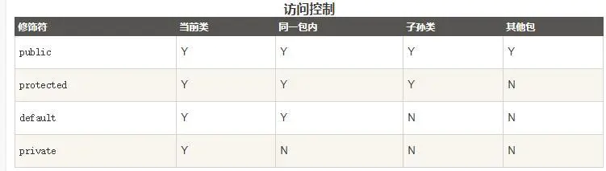
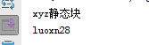
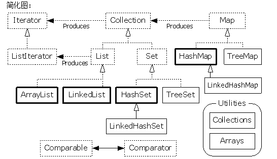
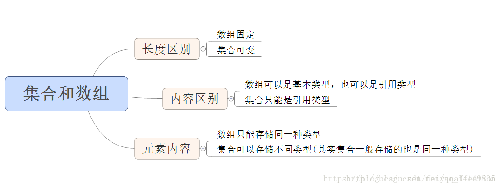
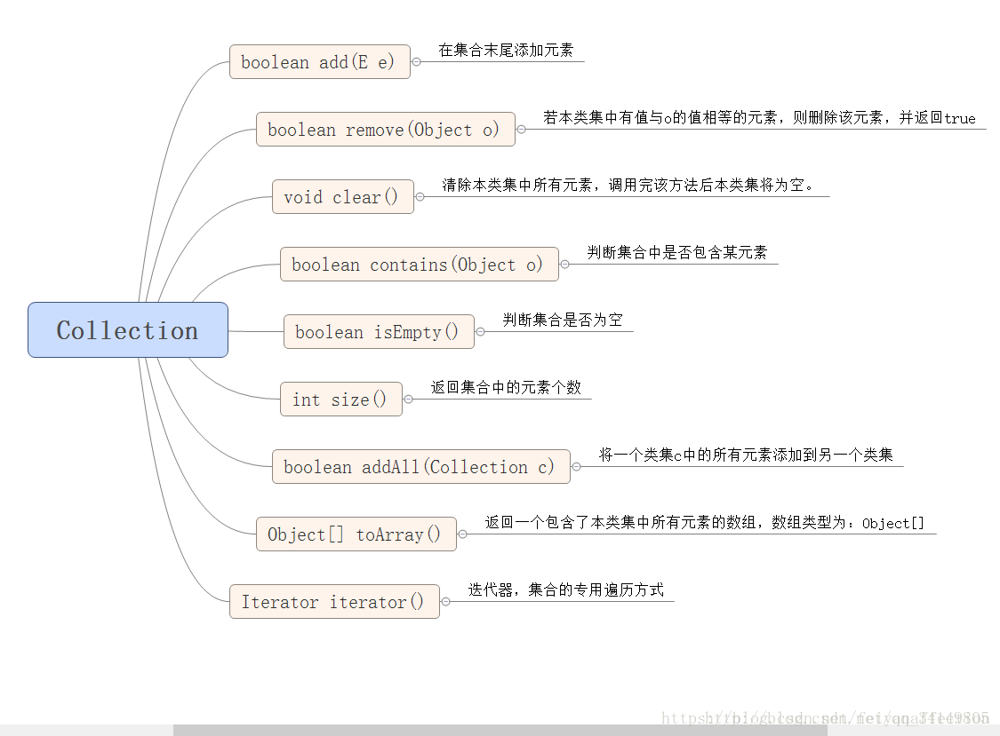
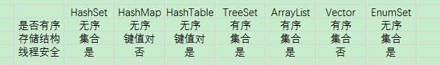

# 一、面向对象概念

### 1. 类与对象

##### 1.1 面向过程和面向对象

 面向过程 （Procedural Programming）侧重流程
 面向对象 （Object-Oriented Programming ）(OOP) 侧重功能

##### 1.2 类和对象的概念、关系、组成

- 概念：

  - **类**：类是一个模板，它描述一组具有相 同属性和方法的对象
  - **对象**：最小子系统，有属性和方法。

- 关系：类是对象的抽象，对象是类的实例

- 组成：

  - 成员变量（Attributes）
  - 构造方法（Constructor） 一个类可以有多个构 造方法
  - 成员方法（Methods）

<!--more-->

##### 1.3 构造函数，对象的初始化、使用

- 构造方法：在创建一个对象的时候，至少要调用一个构造方法。 构造方法的名称必须与类同名，一个类可以有多个构 造方法。

- 对象初始化：

  - 声明：声明一个对象，包括对象名称和对象类型。
  - 实例化：使用关键字new来创建一个对象。
  - 初始化：使用new创建对象时，会调用构造方法初始化对象

- 对象的使用：

  

  ```cpp
  /* 实例化对象 */ ObjectReference = new Constructor();
  /* 访问成员变量 */ ObjectReference.variableName; 
  /* 访问成员方法 */ ObjectReference.MethodName();
  ```

### 2.  封装、继承、多态

##### 2.1  封装 Encapsulation

**好处：**
 从设计上讲，为了实现模块化
 从使用上讲，减少了复杂度
 良好的封装能够减少代码的耦合

**实现：**




 private: 只能被该类的对象访问。
 default: 即不加任何访问修饰符，只允许在同一个包中进行访问。
 protected: 只能被类本身的方法及子类访问，即使子类在不同的包中也可以访问。
 public： 不仅可以跨类访问，而且允许跨包（package）访问。


一个源文件中只能有一个public类;
 源文件的名称应该和public类的类名保持一致;
 如果一个类定义在某个包中，那么package语句应该在源文件的首行;

##### 2.2 继承 Heritage

继承是一种类和类之间的关系，是一种“is a kind of”的关系。
 **好处：**
 易于修改，容易扩展

**实现：**


```java
public class Parent{   … }  
public class Child extends Parent {   … } 
```

java中的继承是单继承的，一个子类只能继承一个父类，使用extends关键字
 子类继承了父类中所有非private成员方法（除了构造方法）和所有非private的成员变量。

**super：**
 对于构造函数而言，它只能够被调用，而不能被继承。
 当我们需要调用父类的构造方法时，只需使用super()即可

**重写（覆盖） override：**
 子类中有和父类中可访问（可继承到子类）的同名&&同返 回类型&&同参数表的方法，就会重写（覆盖）从父类继承来 的方法。

**重载 overload：**
 被重载的方法必须改变参数列表(参 数个数或类型或顺序不一样)；
 被重载的方法可以改变返回类型；
 被重载的方法可以改变访问修饰符；
 final 关键字声明类可以把类定义为不能继承的，即最终类； 或者用于修饰方法，该方法不能被子类重写：

**向上转型**
 上转型对象可以操作被子类继承和重写的方法，但不能操作子类新增的成员变量和方法。

##### 2.3 多态 Polymorphism

**多态就是指一种名称定义不同的方法**

**分类**
 编译时多态 - 方法的重载（overload）
 运行时多态 - 程序中定义的引用变量所指向的具体类型和通过该引用变量发出的方法调用在编程 时并不确定，而是在程序运行期间才确定，即一个引用变量倒底会指向哪个类的实 例对象，该引用变量发出的方法调用到底是哪个类中实现的方法，必须在由程序运 行期间才能决定。

**实现方法（继承、接口）**
 以继承实现多态 -向上转型、方法重写，以一般代表特殊，以特殊代替一般
 以接口实现多态

**如何使用**
 可以在方法的参数中传入其父类（或接口）类型，在运行时会根据实际的运行时类型来 在方法中进行相应的操作。
 多态用于返回值，可以在方法的返回值类型上使用其实际返回值的父（接口）类型，不关心返回值的实际类型。

### 3.抽象类和抽象方法，静态方法和静态变量

具体类：可以被实例化的类
 抽象类：不能被实例化的类
 定义抽象类的基本目的是提供合适的超类， 使其他类可以继承它，以实现共享。


```csharp
public abstract class Form{   …   public abstract void draw(); } 
```

### 4. 接口

**定义**


```php
[public] interface 接口名 [extends 其他的接口名列表] {
    [public static final] 数据类型 常量名 = 值;
    [public abstract] 返回类型 方法名（形参列表）;
}
```

**实现**


```dart
[访问修饰符] class 类名 [extends 超类名] implements 接口名列表 {
        类体 
}
```

**特性**
 接口中可以含有变量，变量会被隐式的指定为 public static final（用 private 修饰 会报编译错误）
 接口中的方法会被隐式的指定为 public abstract

**功能**

1. 接口提供了一组功能的命名集合
2. 接口定义了不同类交互的标准
    实现了“多继承” ；分离了方法的声明和方法的实现

**接口 v.s. 类**
 接口不能用于实例化对象。
 接口没有构造方法。
 接口中所有的方法必须是抽象方法。
 接口只能包含static final成员变量。
 接口不是被类继承了，而是要被类实现。
 接口支持多继承。

抽象类是对类抽象，而接口是对行为的抽象
 抽象类是自底向上抽象而来的，接口是自顶向下设计出来的

**接口名作为类型**
 可以把使用实现了某一接口的类创建的对象的引用赋给该接口声明的接口变量， 那么该接口变量就可以调用被类实现的接口的方法。

# 二、反射及动态代理

反射 一般使用 Class.forName()方法;

动态代理就是实现InvocationHandler 接口；

要想理解反射的原理，首先要了解什么是类型信息。Java让我们在运行时识别对象和类的信息，主要有2种方式：一种是传统的RTTI，它假定我们在编译时已经知道了所有的类型信息；另一种是反射机制，它允许我们在运行时发现和使用类的信息。

### 1、Class对象

　　理解RTTI在Java中的工作原理，首先需要知道类型信息在运行时是如何表示的，这是由Class对象来完成的，它包含了与类有关的信息。Class对象就是用来创建所有“常规”对象的，Java使用Class对象来执行RTTI，即使你正在执行的是类似类型转换这样的操作。

　　每个类都会产生一个对应的Class对象，也就是保存在.class文件。所有类都是在对其第一次使用时，动态加载到JVM的，当程序创建一个对类的静态成员的引用时，就会加载这个类。Class对象仅在需要的时候才会加载，static初始化是在类加载时进行的。 

```
public class TestMain {
    public static void main(String[] args) {
        System.out.println(XYZ.name);
    }
}

class XYZ {
    public static String name = "luoxn28";

    static {
        System.out.println("xyz静态块");
    }

    public XYZ() {
        System.out.println("xyz构造了");
    }
}
```

输出结果为：



　　类加载器首先会检查这个类的Class对象是否已被加载过，如果尚未加载，默认的类加载器就会根据类名查找对应的.class文件。

　　想在运行时使用类型信息，必须获取对象(比如类Base对象)的Class对象的引用，使用功能Class.forName(“Base”)可以实现该目的，或者使用base.class。注意，有一点很有趣，使用功能”.class”来创建Class对象的引用时，不会自动初始化该Class对象，使用forName()会自动初始化该Class对象。为了使用类而做的准备工作一般有以下3个步骤：

- 加载：由类加载器完成，找到对应的字节码，创建一个Class对象
- 链接：验证类中的字节码，为静态域分配空间
- 初始化：如果该类有超类，则对其初始化，执行静态初始化器和静态初始化块 

```
public class Base {
    static int num = 1;
    
    static {
        System.out.println("Base " + num);
    }
}
public class Main {
    public static void main(String[] args) {
        // 不会初始化静态块
        Class clazz1 = Base.class;
        System.out.println("------");
        // 会初始化
        Class clazz2 = Class.forName("zzz.Base");
    }
}
```

 

### 2、类型转换前先做检查

　　编译器将检查类型向下转型是否合法，如果不合法将抛出异常。向下转换类型前，可以使用instanceof判断。 

[](javascript:void(0);)

```
class Base { }
class Derived extends Base { }

public class Main {
    public static void main(String[] args) {
        Base base = new Derived();
        if (base instanceof Derived) {
            // 这里可以向下转换了
            System.out.println("ok");
        }
        else {
            System.out.println("not ok");
        }
    }
}
```

 

### 3、反射：运行时类信息

　　如果不知道某个对象的确切类型，RTTI可以告诉你，但是有一个前提：这个类型在编译时必须已知，这样才能使用RTTI来识别它。Class类与java.lang.reflect类库一起对反射进行了支持，该类库包含Field、Method和Constructor类，这些类的对象由JVM在启动时创建，用以表示未知类里对应的成员。这样的话就可以使用Contructor创建新的对象，用get()和set()方法获取和修改类中与Field对象关联的字段，用invoke()方法调用与Method对象关联的方法。另外，还可以调用getFields()、getMethods()和getConstructors()等许多便利的方法，以返回表示字段、方法、以及构造器对象的数组，这样，对象信息可以在运行时被完全确定下来，而在编译时不需要知道关于类的任何事情。

　　反射机制并没有什么神奇之处，当通过反射与一个未知类型的对象打交道时，JVM只是简单地检查这个对象，看它属于哪个特定的类。因此，那个类的`.class`对于JVM来说必须是可获取的，要么在本地机器上，要么从网络获取。所以对于RTTI和反射之间的真正区别只在于：

- RTTI，编译器在编译时打开和检查.class文件
- 反射，运行时打开和检查.class文件 

```
public class Person implements Serializable {

    private String name;
    private int age;
// get/set方法
}
public static void main(String[] args) {
    Person person = new Person("luoxn28", 23);
    Class clazz = person.getClass();

    Field[] fields = clazz.getDeclaredFields();
    for (Field field : fields) {
        String key = field.getName();
        PropertyDescriptor descriptor = new PropertyDescriptor(key, clazz);
        Method method = descriptor.getReadMethod();
        Object value = method.invoke(person);

        System.out.println(key + ":" + value);

    }
}
```

　　以上通过getReadMethod()方法调用类的get函数，可以通过getWriteMethod()方法来调用类的set方法。通常来说，我们不需要使用反射工具，但是它们在创建动态代码会更有用，反射在Java中用来支持其他特性的，例如对象的序列化和JavaBean等。

### 4、动态代理

　　代理模式是为了提供额外或不同的操作，而插入的用来替代”实际”对象的对象，这些操作涉及到与”实际”对象的通信，因此代理通常充当中间人角色。Java的动态代理比代理的思想更前进了一步，它可以动态地创建并代理并动态地处理对所代理方法的调用。在动态代理上所做的所有调用都会被重定向到单一的**调用处理器**上，它的工作是揭示调用的类型并确定相应的策略。 

 

**学习Spring的时候，我们知道Spring主要有两大思想，一个是IoC，另一个就是AOP，对于IoC，它利用的是反射机制，依赖注入就不用多说了，而对于Spring的核心AOP来说，使用了动态代理，其实底层也是反射。我们不但要知道怎么通过AOP来满足的我们的功能，我们更需要学习的是其底层是怎么样的一个原理，而AOP的原理就是java的动态代理机制，所以本篇随笔就是对java的动态机制进行一个回顾。**

在java的动态代理机制中，有两个重要的类或接口，一个是 InvocationHandler(Interface)、另一个则是 Proxy(Class)，这一个类和接口是实现我们动态代理所必须用到的。首先我们先来看看java的API帮助文档是怎么样对这两个类进行描述的：

InvocationHandler:

```
InvocationHandler is the interface implemented by the invocation handler of a proxy instance. 

Each proxy instance has an associated invocation handler. When a method is invoked on a proxy instance, the method invocation is encoded and dispatched to the invoke method of its invocation handler.
```

每一个动态代理类都必须要实现InvocationHandler这个接口，并且每个代理类的实例都关联到了一个handler，当我们通过代理对象调用一个方法的时候，这个方法的调用就会被转发为由InvocationHandler这个接口的 invoke 方法来进行调用。我们来看看InvocationHandler这个接口的唯一一个方法 invoke 方法：

```
Object invoke(Object proxy, Method method, Object[] args) throws Throwable
```

我们看到这个方法一共接受三个参数，那么这三个参数分别代表什么呢？

```
Object invoke(Object proxy, Method method, Object[] args) throws Throwable

proxy:　　指代我们所代理的那个真实对象
method:　　指代的是我们所要调用真实对象的某个方法的Method对象
args:　　指代的是调用真实对象某个方法时接受的参数
```

如果不是很明白，等下通过一个实例会对这几个参数进行更深的讲解。

接下来我们来看看Proxy这个类：

```
Proxy provides static methods for creating dynamic proxy classes and instances, and it is also the superclass of all dynamic proxy classes created by those methods. 
```

Proxy这个类的作用就是用来动态创建一个代理对象的类，它提供了许多的方法，但是我们用的最多的就是 newProxyInstance 这个方法：

```
public static Object newProxyInstance(ClassLoader loader, Class<?>[] interfaces,  InvocationHandler h)  throws IllegalArgumentException
Returns an instance of a proxy class for the specified interfaces that dispatches method invocations to the specified invocation handler.
```

这个方法的作用就是得到一个动态的代理对象，其接收三个参数，我们来看看这三个参数所代表的含义： 

```
public static Object newProxyInstance(ClassLoader loader, Class<?>[] interfaces, InvocationHandler h) throws IllegalArgumentException

loader:　　一个ClassLoader对象，定义了由哪个ClassLoader对象来对生成的代理对象进行加载

interfaces:　　一个Interface对象的数组，表示的是我将要给我需要代理的对象提供一组什么接口，如果我提供了一组接口给它，那么这个代理对象就宣称实现了该接口(多态)，这样我就能调用这组接口中的方法了

h:　　一个InvocationHandler对象，表示的是当我这个动态代理对象在调用方法的时候，会关联到哪一个InvocationHandler对象上
```

好了，在介绍完这两个接口(类)以后，我们来通过一个实例来看看我们的动态代理模式是什么样的：

首先我们定义了一个Subject类型的接口，为其声明了两个方法：

```
public interface Subject
{
    public void rent();
    
    public void hello(String str);
}
```

接着，定义了一个类来实现这个接口，这个类就是我们的真实对象，RealSubject类：  

下一步，我们就要定义一个动态代理类了，前面说个，每一个动态代理类都必须要实现 InvocationHandler 这个接口，因此我们这个动态代理类也不例外： 

```
public class DynamicProxy implements InvocationHandler
{
    //　这个就是我们要代理的真实对象
    private Object subject;
    
    //    构造方法，给我们要代理的真实对象赋初值
    public DynamicProxy(Object subject)
    {
        this.subject = subject;
    }
    
    @Override
    public Object invoke(Object object, Method method, Object[] args)
            throws Throwable
    {
        //　　在代理真实对象前我们可以添加一些自己的操作
        System.out.println("before invoke");
        
        System.out.println("Method:" + method);
        
        //    当代理对象调用真实对象的方法时，其会自动的跳转到代理对象关联的handler对象的invoke方法来进行调用
        method.invoke(subject, args);
        
        //　　在代理真实对象后我们也可以添加一些自己的操作
        System.out.println("after invoke");
        
        return null;
    }

}[](javascript:void(0);
```

 

最后，来看看我们的Client类： 

```
public class Client
{
    public static void main(String[] args)
    {
        //    我们要代理的真实对象
        Subject realSubject = new RealSubject();

        //    我们要代理哪个真实对象，就将该对象传进去，最后是通过该真实对象来调用其方法的
        InvocationHandler handler = new DynamicProxy(realSubject);

        /*
         * 通过Proxy的newProxyInstance方法来创建我们的代理对象，我们来看看其三个参数
         * 第一个参数 handler.getClass().getClassLoader() ，我们这里使用handler这个类的ClassLoader对象来加载我们的代理对象
         * 第二个参数realSubject.getClass().getInterfaces()，我们这里为代理对象提供的接口是真实对象所实行的接口，表示我要代理的是该真实对象，这样我就能调用这组接口中的方法了
         * 第三个参数handler， 我们这里将这个代理对象关联到了上方的 InvocationHandler 这个对象上
         */
        Subject subject = (Subject)Proxy.newProxyInstance(handler.getClass().getClassLoader(), realSubject
                .getClass().getInterfaces(), handler);
        
        System.out.println(subject.getClass().getName());
        subject.rent();
        subject.hello("world");
    }
}
```

我们先来看看控制台的输出： 

```
$Proxy0

before invoke
Method:public abstract void com.xiaoluo.dynamicproxy.Subject.rent()
I want to rent my house
after invoke

before invoke
Method:public abstract void com.xiaoluo.dynamicproxy.Subject.hello(java.lang.String)
hello: world
after invoke
```

当调试的时候，如果把鼠标放在subject 上面，会自动的执行toString()方法，也就是

```
before invoke
Method:public abstract void com.xiaoluo.dynamicproxy.Subject.toString()
 
after invoke
```

 

我们首先来看看 $Proxy0 这东西，我们看到，这个东西是由 System.out.println(subject.getClass().getName()); 这条语句打印出来的，那么为什么我们返回的这个代理对象的类名是这样的呢？

```
Subject subject = (Subject)Proxy.newProxyInstance(handler.getClass().getClassLoader(), realSubject
                .getClass().getInterfaces(), handler);
```

可能我以为返回的这个代理对象会是Subject类型的对象，或者是InvocationHandler的对象，结果却不是**，首先我们解释一下为什么我们这里可以将其转化为Subject类型的对象？原因就是在newProxyInstance这个方法的第二个参数上，我们给这个代理对象提供了一组什么接口，那么我这个代理对象就会实现了这组接口，这个时候我们当然可以将这个代理对象强制类型转化为这组接口中的任意一个，因为这里的接口是Subject类型，所以就可以将其转化为Subject类型了**。

**同时我们一定要记住，通过 Proxy.newProxyInstance 创建的代理对象是在jvm运行时动态生成的一个对象，它并不是我们的InvocationHandler类型，也不是我们定义的那组接口的类型，而是在运行是动态生成的一个对象，并且命名方式都是这样的形式，以$开头，proxy为中，最后一个数字表示对象的标号**。

接着我们来看看这两句 

subject.rent();
subject.hello("world");

这里是通过代理对象来调用实现的那种接口中的方法，这个时候程序就会跳转到由这个代理对象关联到的 handler 中的invoke方法去执行，而我们的这个 handler 对象又接受了一个 RealSubject类型的参数，表示我要代理的就是这个真实对象，所以此时就会调用 handler 中的invoke方法去执行： 

```
public Object invoke(Object object, Method method, Object[] args)
            throws Throwable
    {
        //　　在代理真实对象前我们可以添加一些自己的操作
        System.out.println("before invoke");
        
        System.out.println("Method:" + method);
        
        //    当代理对象调用真实对象的方法时，其会自动的跳转到代理对象关联的handler对象的invoke方法来进行调用
        method.invoke(subject, args);
        
        //　　在代理真实对象后我们也可以添加一些自己的操作
        System.out.println("after invoke");
        
        return null;
    }
```

我们看到，在真正通过代理对象来调用真实对象的方法的时候，我们可以在该方法前后添加自己的一些操作，同时我们看到我们的这个 method 对象是这样的：

```
public abstract void com.xiaoluo.dynamicproxy.Subject.rent()

public abstract void com.xiaoluo.dynamicproxy.Subject.hello(java.lang.String)
```

正好就是我们的Subject接口中的两个方法，这也就证明了当我通过代理对象来调用方法的时候，起实际就是委托由其关联到的 handler 对象的invoke方法中来调用，并不是自己来真实调用，而是通过代理的方式来调用的。

这就是我们的java动态代理机制

# 三、java集合

### 1、java中的集合类结构



### 2、List、Set和Map：

​    List是有序的集合，Set是无序的集合。Map是无序的键值对。

#### 1.集合和数组的区别：



#### 2.Collection集合的方法：



### 3、HashMap详解：

​    HashMap有两个参数影响其性能：初始容量和加载因子。默认初始容量是16，加载因子是0.75。容量是哈希表中桶(Entry数组)的数量，初始容量只是哈希表在创建时的容量。加载因子是哈希表在其容量自动增加之前可以达到多满的一种尺度。当哈希表中的条目数超出了加载因子与当前容量的乘积时，通过调用 rehash 方法将容量翻倍。

### 4、ArrayList和Vector对比：

​    都是List的实现类。他们都是有序集合，即存储在这两个集合中的元素的位置都是有顺序的，相当于一种动态的数组，我们以后可以按位置索引号取出某个元素
​    Vector是线程安全的，也就是说是它的方法之间是线程同步的，而ArrayList是线程序不安全的，它的方法之间是线程不同步的。如果只有一个线程会访问到集合，那最好是使用ArrayList，因为它不考虑线程安全，效率会高些；如果有多个线程会访问到集合，那最好是使用Vector，因为不需要我们自己再去考虑和编写线程安全的代码

### 5、ArrayList和LinkedList对比：

​    1.ArrayList是实现了基于动态数组的数据结构，LinkedList基于链表的数据结构。
​    2.对于随机访问get和set，ArrayList觉得优于LinkedList，因为LinkedList要移动指针。
​    3.对于新增和删除操作add和remove，LinedList比较占优势，因为ArrayList要移动数据。

### 6、HashSet和TreeSet对比：

​    HashSet比TreeSet的性能要好，因为TreeSet需要额外的红黑树算法来维护集合的次序。所以只有当需要保持排序的Set时候，才会使用TreeSet，否则都应该使用HashSet。

### 7、HashSet和HashMap对比：

​    都是采用Hash算法来决定元素的存储位置，并通过hash算法来增加集合大小的。其中最大的区别就是，HashSet实现的Set接口，他不允许有重复的值。HashMap实现的是Map接口，里面存储的是键值对，map中不允许存在重复的key。

### 8、HashMap和HashTable对比：

​    HashTable是一个线程安全的Map实现，但HashMap是线程不安全的实现，所以HashMap比HashTable的性能高一些；但是如果有多个线程访问同一个Map对象时候，应该使用HashTable。
​    HashTable不允许使用null作为key和value，如果视图把null值放入HashTable中会引发NullPointerException异常，但是HashMap可以使用null作为key或value。null可以作为键，这样的键只有一个；可以有一个或多个键所对应的值为null。当get()方法返回null值时，即可以表示 HashMap中没有该键，也可以表示该键所对应的值为null。因此，在HashMap中不能由get()方法来判断HashMap中是否存在某个键，而应该用containsKey()方法来判断。

## 各集合对比：

