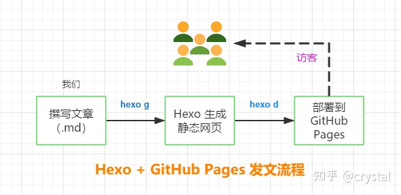
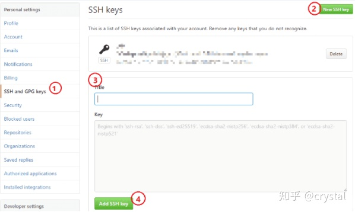
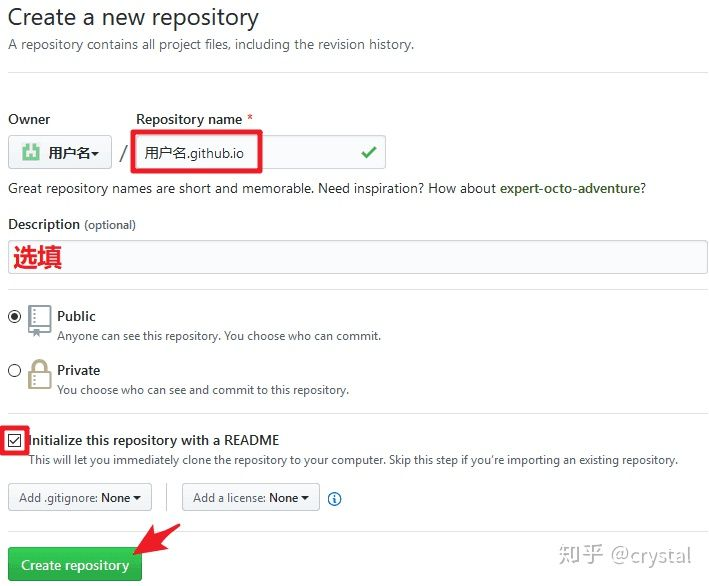
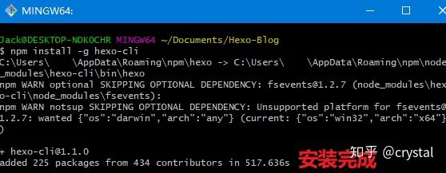
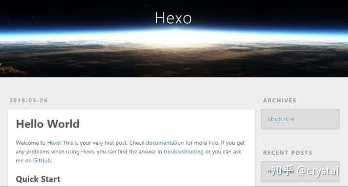
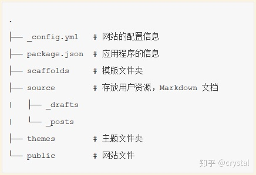
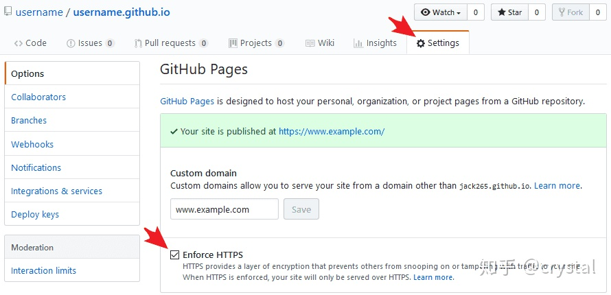
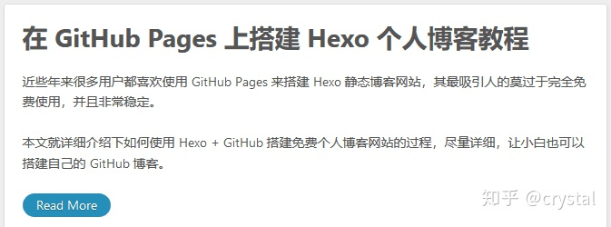

<!-- toc -->

[TOC]


## 前言

近些年来很多用户都喜欢使用 GitHub Pages 来搭建 Hexo 静态博客网站，其最吸引人的莫过于完全免费使用，并且非常稳定。

虽然搭建时比较麻烦，有点折腾，但是配置完成后，基本不需要操心维护的事，甚至放了几年都忘记了，打开来看文章依然还在。

本文就详细介绍下如何使用 Hexo + GitHub 搭建免费个人博客网站的教程。

------

为了照顾小白用户（第一次使用 GitHub 和 Hexo），尽可能详细，包括常见的坑和问题都有提示说明。下面目录中**第 3~5 步为最重要的步骤**，其他内容如果已经会的可以选择性跳过。

看起来有点繁杂，捋顺了倒也简单，认真跟教程走，完整操作一遍大概需要 30 分钟。

<!--more-->

**内容目录：**

- 简介：GitHub Pages 和 Hexo & 原理

1. 准备：环境搭建
   1.1. 注意事项
   1.2. 环境搭建
2. 连接 Github
3. 创建 Github Pages 仓库
4. 本地安装 Hexo 博客程序
   4.1. 安装 Hexo
   4.2. Hexo 初始化和本地预览
5. 部署 Hexo 到 GitHub Pages
6. 绑定域名（可选）
7. 开始使用
   7.1. 发布文章
   7.2. 网站设置
   7.3. 更换主题
   7.4. 常用代码
8. 常见问题

## 简介

### GitHub Pages 是什么？

- [What is GitHub Pages? - GitHub Help](https://link.zhihu.com/?target=https%3A//help.github.com/en/articles/what-is-github-pages)

GitHub Pages 是由 GitHub 官方提供的一种免费的静态站点托管服务，让我们可以在 GitHub 仓库里托管和发布自己的静态网站页面。

### Hexo 是什么？

- 官网：[hexo.io](https://link.zhihu.com/?target=https%3A//hexo.io/zh-cn/)

Hexo 是一个快速、简洁且高效的静态博客框架，它基于 Node.js 运行，可以将我们撰写的 Markdown 文档解析渲染成静态的 HTML 网页。

### Hexo + GitHub 文章发布原理

在本地撰写 Markdown 格式文章后，通过 Hexo 解析文档，渲染生成具有主题样式的 HTML 静态网页，再推送到 GitHub 上完成博文的发布。



### 优点和不足

**优点：**完全免费；静态站点，轻量快速；可按需求自由定制改造；托管在 GitHub，安全省心；迁移方便……

**不足：**发文不便，依赖于本地环境；更适合个人博客使用；GitHub 在国内访问速度有点不快。

## 1. 准备

### 注意事项

- 输入代码时，核对准确，最好切换成英文输入法；
- 将文中的 “用户名” 和 “邮箱” 替换为自己的 GitHub 账户名和绑定的邮箱；
- 统一使用 Git Bash 进行操作（支持 Win、Mac）；
- 小白请严格按步骤进行，不要跳！

###  环境搭建

Hexo 基于 Node.js，搭建过程中还需要使用 npm（Node.js 已带） 和 git，因此先搭建本地操作环境，安装 Node.js 和 Git。

- Node.js：[https://nodejs.org/zh-cn](https://link.zhihu.com/?target=https%3A//nodejs.org/zh-cn)
- Git：[https://git-scm.com/downloads](https://link.zhihu.com/?target=https%3A//git-scm.com/downloads)

下载 Node.js 和 Git 程序并安装，一路点 “下一步” 按默认配置完成安装。

安装完成后，Win+R 输入 cmd 并打开，依次输入 `node -v`、`npm -v` 和 `git --version` 并回车，如下图出现程序版本号即可。


## 2. 连接 Github

使用邮箱注册 [GitHub](https://link.zhihu.com/?target=https%3A//github.com/) 账户，选择免费账户（Free），并完成邮件验证。

右键 -> Git Bash Here，**设置用户名和邮箱**：

```text
git config --global user.name "GitHub 用户名"
git config --global user.email "GitHub 邮箱"
```

**创建 SSH 密匙**：

输入 `ssh-keygen -t rsa -C "GitHub 邮箱"`，然后一路回车。

**添加密匙：**

进入 [C:\Users\用户名\.ssh] 目录（要勾选显示“隐藏的项目”），用记事本打开公钥 id_rsa.pub 文件并复制里面的内容。

登陆 GitHub ，进入 Settings 页面，选择左边栏的 SSH and GPG keys，点击 New SSH key。

Title 随便取个名字，粘贴复制的 id_rsa.pub 内容到 Key 中，点击 Add SSH key 完成添加。



**验证连接：**

打开 Git Bash，输入 `ssh -T git@github.com` 出现 “Are you sure……”，输入 yes 回车确认。


显示 “Hi xxx! You've successfully……” 即连接成功。

## 3. 创建 Github Pages 仓库

GitHub 主页右上角加号 -> New repository：

- Repository name 中输入 `用户名.github.io`
- 勾选 “Initialize this repository with a README”
- Description 选填

填好后点击 Create repository 创建。



创建后默认自动启用 HTTPS，博客地址为：`https://用户名.github.io`

## 4. 本地安装 Hexo 博客程序

新建一个文件夹用来存放 Hexo 的程序文件，如 Hexo-Blog。打开该文件夹，右键 -> Git Bash Here。

### 4.1 安装 Hexo

使用 npm 一键安装 Hexo 博客程序：

```text
npm install -g hexo-cli
```

Mac 用户需要管理员权限（sudo），运行这条命令：

```text
sudo npm install -g hexo-cli
```

安装时间有点久（真的很慢！），界面也没任何反应，**耐心等待**，安装完成后如下图。



### 4.2 Hexo 初始化和本地预览

**初始化并安装所需组件：**

```text
hexo init      # 初始化
npm install    # 安装组件
```

完成后依次输入下面命令，**启动本地服务器进行预览**：

```text
hexo g   # 生成页面
hexo s   # 启动预览
```

**访问** `http://localhost:4000`**，出现 Hexo 默认页面，本地博客安装成功！**



**Tips：**如果出现页面加载不出来，可能是端口被占用了。Ctrl+C 关闭服务器，运行 `hexo server -p 5000` 更改端口号后重试。

Hexo 博客文件夹目录结构如下：



## 5. 部署 Hexo 到 GitHub Pages

本地博客测试成功后，就是上传到 GitHub 进行部署，使其能够在网络上访问。

首先**安装 hexo-deployer-git**：

```text
npm install hexo-deployer-git --save
```

然后**修改 _config.yml** 文件末尾的 Deployment 部分，修改成如下：

```text
deploy:
  type: git
  repository: git@github.com:用户名/用户名.github.io.git
  branch: master
```

完成后运行 `hexo d` 将网站上传部署到 GitHub Pages。

完成！这时访问我们的 GitHub 域名 `https://用户名.github.io` 就可以看到 Hexo 网站了。

## 6. 绑定域名（可选）

博客搭建完成使用的是 GitHub 的子域名（用户名.[http://github.io](https://link.zhihu.com/?target=http%3A//github.io)），我们可以为 Hexo 博客绑定自己的域名替换 GitHub 域名，更加个性化和专业，也利于 SEO。

我们使用 [Namesilo](https://link.zhihu.com/?target=https%3A//www.namesilo.com/%3Frid%3Dd27fa32do) 进行注册，便宜好用没啥套路，使用优惠码 `okoff` 优惠一美元，com 域名大概 50 块一年。

###  6.1 域名注册和解析

- 域名注册和解析教程：[Namesilo 域名购买及使用教程](https://zhuanlan.zhihu.com/p/33921436)

按上面教程注册并解析域名，在 DNS 设置部分，删除自带的记录，然后添加 CNAME 记录将 www 域名解析指向 `用户名.github.io`。


###  6.2 绑定域名到 Hexo 博客

进入本地博客文件夹的 source 目录，打开记事本，里面输入自己的域名，如 http://www.example.com，保存名称为 “CNAME”，格式为 “所有文件”（无 .txt 后缀）。

清除缓存等文件并重新发布网站：

```text
hexo clean   # 清除缓存文件等
hexo g       # 生成页面
hexo s       # 启动预览
```

现在就可以使用自己的域名访问 Hexo 博客了。

###  6.3 开启 HTTPS

配置自己的域名后，需要我们手动开启 HTTPS。打开博客所在 GitHub 仓库，Settings -> 下拉找到 GitHub Pages -> 勾选 Enforce HTTPS。



HTTPS 证书部署成功需要一定时间，等大概几分钟再访问域名，就可以看到域名前面的小绿锁了，HTTPS 配置完成！

## 7. 开始使用

### 7.1 发布文章

进入博客所在目录，右键打开 Git Bash Here，创建博文：

```text
hexo new "My New Post"
```

然后 source 文件夹中会出现一个 My New Post.md 文件，就可以使用 Markdown 编辑器在该文件中撰写文章了。

写完后运行下面代码将文章渲染并部署到 GitHub Pages 上完成发布。**以后每次发布文章都是这两条命令。**

```text
hexo g   # 生成页面
hexo d   # 部署发布
```

------

也可以不使用命令自己创建 .md 文件，只需在文件开头手动加入如下格式 Front-matter 即可，写完后运行 `hexo g` 和 `hexo d` 发布。

```text
---
title: Hello World # 标题
date: 2019/3/26 hh:mm:ss # 时间
categories: # 分类
- Diary
tags: # 标签
- PS3
- Games
---

```

###  7.2 网站设置

包括网站名称、描述、作者、链接样式等，全部在网站目录下的 _config.yml 文件中，参考[官方文档](https://link.zhihu.com/?target=https%3A//hexo.io/zh-cn/docs/configuration)按需要编辑。

注意：冒号后要加一个空格！

###  7.3 更换主题

在 [Themes | Hexo](https://link.zhihu.com/?target=https%3A//hexo.io/themes/) 选择一个喜欢的主题，比如 [NexT](https://link.zhihu.com/?target=http%3A//theme-next.iissnan.com/getting-started.html)，进入网站目录打开 Git Bash Here 下载主题：

```text
git clone https://github.com/iissnan/hexo-theme-next themes/next
```

然后修改 _config.yml 中的 theme 为新主题名称 next，发布。（有的主题需要将 _config.yml 替换为主题自带的，参考主题说明。）

### 7.4 常用命令

```text
hexo new "name"       # 新建文章
hexo new page "name"  # 新建页面
hexo g                # 生成页面
hexo d                # 部署
hexo g -d             # 生成页面并部署
hexo s                # 本地预览
hexo clean            # 清除缓存和已生成的静态文件
hexo help             # 帮助
```

## 8 常见问题

**1、Hexo 设置显示文章摘要，首页不显示全文**

Hexo 主页文章列表默认会显示文章全文，浏览时很不方便，可以在文章中插入 `<!--more-->` 进行分段。

该代码前面的内容会作为摘要显示，而后面的内容会替换为 “Read More” 隐藏起来。



**2、设置网站图标**

进入 themes/主题 文件夹，打开 _config.yml 配置文件，找到 favicon 修改，一般格式为：`favicon: 图标地址`。（不同主题可能略有差别）

**3、修改并部署后没有效果**

使用 `hexo clean` 清理后重新部署。

**4、开启 HTTPS 后访问网站显示连接不安全？**

证书还未部署生效，等待一会儿，清除浏览器缓存再试。

**5、Mac 安装 Hexo 报错无法安装**

Mac 用户需要管理员权限运行，使用 `sudo npm install -g hexo-cli` 命令安装。

**6、npm 下载速度慢，甚至完全没反应**

使用 npm 安装程序等待很久也没反应，或者下载速度很慢，可以更换 npm 源为国内 npm 镜像。

临时更换方法：在 npm 安装命令后面加上：

```text
--registry https://registry.npm.taobao.org 
```

## 结语

Hexo 是一种纯静态的博客，我们必须要在本地完成文章的编辑再部署到 GitHub 上，依赖于本地环境。不能像 WordPress 或 Typecho 那样的动态博客一样能直接在浏览器中完成撰文和发布。