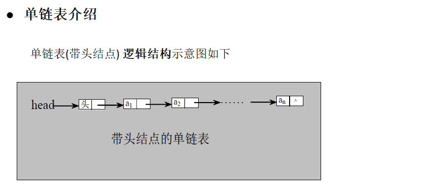
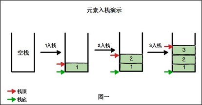
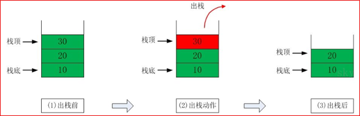
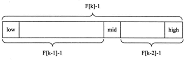
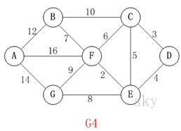

<!-- toc -->

[TOC]


## 前言

​	由于面试的时候数据结构在其占不可获取的地位，所以简单总结下数据结构相关知识，以便复习。

<!--more-->

## 一、队列

**队列介绍**


1.队列是一个有序列表，可以用**数组**或是**链表**来实现。

2.遵循**先入先出**的原则。即：先存入队列的数据，要先取出。后存入的要后取出

示意图：(使用数组模拟队列示意图)


### 数组队列代码

```java
package queue;

import java.util.Scanner;

public class ArrayQueueDemo {

	public static void main(String[] args) {
		//测试一把
		//创建一个队列
		ArrayQueue queue = new ArrayQueue(3);
		char key = ' '; //接收用户输入
		Scanner scanner = new Scanner(System.in);//
		boolean loop = true;
		//输出一个菜单
		while(loop) {
			System.out.println("s(show): 显示队列");
			System.out.println("e(exit): 退出程序");
			System.out.println("a(add): 添加数据到队列");
			System.out.println("g(get): 从队列取出数据");
			System.out.println("h(head): 查看队列头的数据");
			key = scanner.next().charAt(0);//接收一个字符
			switch (key) {
			case 's':
				queue.showQueue();
				break;
			case 'a':
				System.out.println("输出一个数");
				int value = scanner.nextInt();
				queue.addQueue(value);
				break;
			case 'g': //取出数据
				try {
					int res = queue.getQueue();
					System.out.printf("取出的数据是%d\n", res);
				} catch (Exception e) {
					// TODO: handle exception
					System.out.println(e.getMessage());
				}
				break;
			case 'h': //查看队列头的数据
				try {
					int res = queue.headQueue();
					System.out.printf("队列头的数据是%d\n", res);
				} catch (Exception e) {
					// TODO: handle exception
					System.out.println(e.getMessage());
				}
				break;
			case 'e': //退出
				scanner.close();
				loop = false;
				break;
			default:
				break;
			}
		}
		
		System.out.println("程序退出~~");
	}

}

// 使用数组模拟队列-编写一个ArrayQueue类
class ArrayQueue {
	private int maxSize; // 表示数组的最大容量
	private int front; // 队列头
	private int rear; // 队列尾
	private int[] arr; // 该数据用于存放数据, 模拟队列

	// 创建队列的构造器
	public ArrayQueue(int arrMaxSize) {
		maxSize = arrMaxSize;
		arr = new int[maxSize];
		front = -1; // 指向队列头部，分析出front是指向队列头的前一个位置.
		rear = -1; // 指向队列尾，指向队列尾的数据(即就是队列最后一个数据)
	}

	// 判断队列是否满
	public boolean isFull() {
		return rear == maxSize - 1;
	}

	// 判断队列是否为空
	public boolean isEmpty() {
		return rear == front;
	}

	// 添加数据到队列
	public void addQueue(int n) {
		// 判断队列是否满
		if (isFull()) {
			System.out.println("队列满，不能加入数据~");
			return;
		}
		rear++; // 让rear 后移
		arr[rear] = n;
	}

	// 获取队列的数据, 出队列
	public int getQueue() {
		// 判断队列是否空
		if (isEmpty()) {
			// 通过抛出异常
			throw new RuntimeException("队列空，不能取数据");
		}
		front++; // front后移
		return arr[front];

	}

	// 显示队列的所有数据
	public void showQueue() {
		// 遍历
		if (isEmpty()) {
			System.out.println("队列空的，没有数据~~");
			return;
		}
		for (int i = 0; i < arr.length; i++) {
			System.out.printf("arr[%d]=%d\n", i, arr[i]);
		}
	}

	// 显示队列的头数据， 注意不是取出数据
	public int headQueue() {
		// 判断
		if (isEmpty()) {
			throw new RuntimeException("队列空的，没有数据~~");
		}
		return arr[front + 1];
	}
}

```

### 数组模拟环形队列

​	对前面的数组模拟队列的优化，充分利用数组. 
 因此将数组看做是一个环形的。(通过取模的方
 式来实现即可)

```java
class CircleQueue {
    private int maxSize;
    private int[] arr; // 该数组存放数据，模拟队列
    private int front; // 指向队列头部
    private int rear; // 指向队列的尾部
    public CircleArrayQueue(int arrMaxSize) {
        maxSize = arrMaxSize;
        arr = new int[maxSize];
    } 
    public boolean isFull()  {
        //尾索引的下一个为头索引时表示队列满，即将队列容量空出一个作为约定(!!!)
        return (rear + 1) % maxSize == front; }

    public boolean isEmpty()  {
        this.tail == this.head }

    public void addQueue(int n) {
        if (isFull()) {
            System.out.println("队列满，无法加入..");
            return;}
        arr[rear] = n;
        rear = (rear + 1) % maxSize;}  
    public int getQueue() {
        if (isEmpty()) {
            throw new RuntimeException("队列空~");}
        int value = arr[front];
        front = (front + 1) % maxSize;
        return value;}
    //计算队列有多个元素
    public int size()  {
        return (rear + maxSize - front) % maxSize;}}
```

## 二、链表

链表是有序的列表，但是它在内存中是存储如下


小结:

1)链表是以节点的方式来存储,是链式存储

2)每个节点包含 data 域， next 域：指向下一个节点.

3)如图：发现链表的**各个节点不一定是连续存储**.

4)链表分带头节点的链表和没有头节点的链表，根据实际的需求来确定

### 单链表



```java

//定义SingleLinkedList 管理我们的英雄
class SingleLinkedList {
    //先初始化一个头节点, 头节点不要动, 不存放具体的数据
    private HeroNode head = new HeroNode(0, "", "");


    //返回头节点
    public HeroNode getHead() {
        return head;
    }

    //添加节点到单向链表
    //思路，当不考虑编号顺序时
    //1. 找到当前链表的最后节点
    //2. 将最后这个节点的next 指向 新的节点
    public void add(HeroNode heroNode) {

        //因为head节点不能动，因此我们需要一个辅助遍历 temp
        HeroNode temp = head;
        //遍历链表，找到最后
        while (true) {
            //找到链表的最后
            if (temp.next == null) {//
                break;
            }
            //如果没有找到最后, 将将temp后移
            temp = temp.next;
        }
        //当退出while循环时，temp就指向了链表的最后
        //将最后这个节点的next 指向 新的节点
        temp.next = heroNode;

    }

    //第二种方式在添加英雄时，根据排名将英雄插入到指定位置
    //(如果有这个排名，则添加失败，并给出提示)
    public void addByOrder(HeroNode heroNode) {
		//因为头节点不能动，因此我们仍然通过一个辅助指针(变量)来帮助找到添加的位置
		//因为单链表，因为我们找的temp 是位于 添加位置的前一个节点，否则插入不了
		HeroNode temp = head;
		boolean flag = false; // flag标志添加的编号是否存在，默认为false
		while(true) {
			if(temp.next == null) {//说明temp已经在链表的最后
				break; //
			}
			if(temp.next.no > heroNode.no) { //位置找到，就在temp的后面插入
				break;
			} else if (temp.next.no == heroNode.no) {//说明希望添加的heroNode的编号已然存在

				flag = true; //说明编号存在
				break;
			}
			temp = temp.next; //后移，遍历当前链表
		}
		//判断flag 的值
		if(flag) { //不能添加，说明编号存在
			System.out.printf("准备插入的英雄的编号 %d 已经存在了, 不能加入\n", heroNode.no);
		} else {
			//插入到链表中, temp的后面
			heroNode.next = temp.next;
			temp.next = heroNode;
		}
    }

    //修改节点的信息, 根据no编号来修改，即no编号不能改.
    //说明
    //1. 根据 newHeroNode 的 no 来修改即可
    public void update(HeroNode newHeroNode) {
        //判断是否空
        if (head.next == null) {
            System.out.println("链表为空~");
            return;
        }
        //找到需要修改的节点, 根据no编号
        //定义一个辅助变量
        HeroNode temp = head.next;
        boolean flag = false; //表示是否找到该节点
        while (true) {
            if (temp == null) {
                break; //已经遍历完链表
            }
            if (temp.no == newHeroNode.no) {
                //找到
                flag = true;
                break;
            }
            temp = temp.next;
        }
        //根据flag 判断是否找到要修改的节点
        if (flag) {
            temp.name = newHeroNode.name;
            temp.nickname = newHeroNode.nickname;
        } else { //没有找到
            System.out.printf("没有找到 编号 %d 的节点，不能修改\n", newHeroNode.no);
        }


    }

    //删除节点
    //思路
    //1. head 不能动，因此我们需要一个temp辅助节点找到待删除节点的前一个节点
    //2. 说明我们在比较时，是temp.next.no 和  需要删除的节点的no比较
    public void del(int no) {
        HeroNode temp = head;
        boolean flag = false; // 标志是否找到待删除节点的
        while (true) {
            if (temp.next == null) { //已经到链表的最后
                break;
            }
            if (temp.next.no == no) {
                //找到的待删除节点的前一个节点temp
                flag = true;
                break;
            }
            temp = temp.next; //temp后移，遍历
        }
        //判断flag
        if (flag) { //找到
            //可以删除
            temp.next = temp.next.next;
        } else {
            System.out.printf("要删除的 %d 节点不存在\n", no);
        }
    }

    //显示链表[遍历]
    public void list() {
		//判断链表是否为空
		if(head.next == null) {
			System.out.println("链表为空");
			return;
		}
		//因为头节点，不能动，因此我们需要一个辅助变量来遍历
		HeroNode temp = head.next;
		while(true) {
			//判断是否到链表最后
			if(temp == null) {
				break;
			}
			//输出节点的信息
			System.out.println(temp);
			//将temp后移， 一定小心
			temp = temp.next;
		}
    }
}

//定义HeroNode ， 每个HeroNode 对象就是一个节点
class HeroNode {
    public int no;
    public String name;
    public String nickname;
    public HeroNode next; //指向下一个节点

    //构造器
    public HeroNode(int no, String name, String nickname) {
        this.no = no;
        this.name = name;
        this.nickname = nickname;
    }

    //为了显示方法，我们重新toString
    @Override
    public String toString() {
        return "HeroNode [no=" + no + ", name=" + name + ", nickname=" + nickname + "]";
    }

}

```

#### 1.求单链表的有效节点个数

```java
 //方法：获取到单链表的节点的个数(如果是带头结点的链表，需求不统计头节点)

    /**
     * @param head 链表的头节点
     * @return 返回的就是有效节点的个数
     */
    public static int getLength(HeroNode head) {
		if(head.next == null) { //空链表
			return 0;
		}
		int length = 0;
		//定义一个辅助的变量, 这里我们没有统计头节点
		HeroNode cur = head.next;
		while(cur != null) {
			length++;
			cur = cur.next; //遍历
		}
		return length;
    }
```

#### 2.查找单链表中的倒数第k个结点 

```java
	//查找单链表中的倒数第k个结点 【新浪面试题】
    //思路
    //1. 编写一个方法，接收head节点，同时接收一个index
    //2. index 表示是倒数第index个节点
    //3. 先把链表从头到尾遍历，得到链表的总的长度 getLength
    //4. 得到size 后，我们从链表的第一个开始遍历 (size-index)个，就可以得到
    //5. 如果找到了，则返回该节点，否则返回nulll
//判断如果链表为空，返回null
		if(head.next == null) {
			return null;//没有找到
		}
		//第一个遍历得到链表的长度(节点个数)
		int size = getLength(head);
		//第二次遍历  size-index 位置，就是我们倒数的第K个节点
		//先做一个index的校验
		if(index <=0 || index > size) {
			return null;
		}
		//定义给辅助变量， for 循环定位到倒数的index
		HeroNode cur = head.next; //3 // 3 - 1 = 2
		for(int i =0; i< size - index; i++) {
			cur = cur.next;
		}
		return cur;
		}
```

#### 3.单链表的反转

```java
  //将单链表反转
    public static void reversetList(HeroNode head) {
        //如果当前链表为空，或者只有一个节点，无需反转，直接返回
        if (head.next == null || head.next.next == null) {
            return;
        }

        //定义一个辅助的指针(变量)，帮助我们遍历原来的链表
        HeroNode cur = head.next;
        HeroNode next = null;// 指向当前节点[cur]的下一个节点
        HeroNode reverseHead = new HeroNode(0, "", "");
        //遍历原来的链表，每遍历一个节点，就将其取出，并放在新的链表reverseHead 的最前端
        //动脑筋
        while (cur != null) {
            next = cur.next;//先暂时保存当前节点的下一个节点，因为后面需要使用
            cur.next = reverseHead.next;//将cur的下一个节点指向新的链表的最前端
            reverseHead.next = cur; //将cur 连接到新的链表上
            cur = next;//让cur后移
        }
        //将head.next 指向 reverseHead.next , 实现单链表的反转
        head.next = reverseHead.next;
    }
```

#### 4.从尾到头打印单链表

```java
 //方式2：
    //可以利用栈这个数据结构，将各个节点压入到栈中，然后利用栈的先进后出的特点，就实现了逆序打印的效果
    public static void reversePrint(HeroNode head) {
		if(head.next == null) {
			return;//空链表，不能打印
		}
		//创建要给一个栈，将各个节点压入栈
		Stack<HeroNode> stack = new Stack<HeroNode>();
		HeroNode cur = head.next;
		//将链表的所有节点压入栈
		while(cur != null) {
			stack.push(cur);
			cur = cur.next; //cur后移，这样就可以压入下一个节点
		}
		//将栈中的节点进行打印,pop 出栈
		while (stack.size() > 0) {
			System.out.println(stack.pop()); //stack的特点是先进后出
		}
	}
```


### 双端链表

```java
// 创建一个双向链表的类
class DoubleLinkedList {

    // 先初始化一个头节点, 头节点不要动, 不存放具体的数据
    private HeroNode2 head = new HeroNode2(0, "", "");

    // 返回头节点
    public HeroNode2 getHead() {
        return head;
    }

    // 遍历双向链表的方法
    // 显示链表[遍历]
    public void list() {
        // 判断链表是否为空
        if (head.next == null) {
            System.out.println("链表为空");
            return;
        }
        // 因为头节点，不能动，因此我们需要一个辅助变量来遍历
        HeroNode2 temp = head.next;
        while (true) {
            // 判断是否到链表最后
            if (temp == null) {
                break;
            }
            // 输出节点的信息
            System.out.println(temp);
            // 将temp后移， 一定小心
            temp = temp.next;
        }
    }


    public void addByorder(HeroNode2 heroNode) {
        HeroNode2 temp = head;
        Boolean flag = false;
        while (true) {
            if (temp.next == null) {
                break;
            }
            if (temp.next.no > heroNode.no) {
                break;
            } else if (temp.next.no == heroNode.no) {
                flag = true;
                break;
            }
            temp = temp.next;
        }
        if (flag) {
            System.out.printf("准备插入的英雄的编号 %d 已经存在了, 不能加入\n", heroNode.no);
        } else {
            //大坑，需要先将temp.next保存起来防止结构变动影响pre指针
            HeroNode2 s1 = temp.next;
            heroNode.next = temp.next;
            temp.next = heroNode;

            heroNode.pre = temp;
            if (s1 != null)
                s1.pre = heroNode;

        }
    }

    // 添加一个节点到双向链表的最后.
    public void add(HeroNode2 heroNode) {

        // 因为head节点不能动，因此我们需要一个辅助遍历 temp
        HeroNode2 temp = head;
        // 遍历链表，找到最后
        while (true) {
            // 找到链表的最后
            if (temp.next == null) {//
                break;
            }
            // 如果没有找到最后, 将将temp后移
            temp = temp.next;
        }
        // 当退出while循环时，temp就指向了链表的最后
        // 形成一个双向链表
        temp.next = heroNode;
        heroNode.pre = temp;
    }

    // 修改一个节点的内容, 可以看到双向链表的节点内容修改和单向链表一样
    // 只是 节点类型改成 HeroNode2
    public void update(HeroNode2 newHeroNode) {
        // 判断是否空
        if (head.next == null) {
            System.out.println("链表为空~");
            return;
        }
        // 找到需要修改的节点, 根据no编号
        // 定义一个辅助变量
        HeroNode2 temp = head.next;
        boolean flag = false; // 表示是否找到该节点
        while (true) {
            if (temp == null) {
                break; // 已经遍历完链表
            }
            if (temp.no == newHeroNode.no) {
                // 找到
                flag = true;
                break;
            }
            temp = temp.next;
        }
        // 根据flag 判断是否找到要修改的节点
        if (flag) {
            temp.name = newHeroNode.name;
            temp.nickname = newHeroNode.nickname;
        } else { // 没有找到
            System.out.printf("没有找到 编号 %d 的节点，不能修改\n", newHeroNode.no);
        }
    }

    // 从双向链表中删除一个节点,
    // 说明
    // 1 对于双向链表，我们可以直接找到要删除的这个节点
    // 2 找到后，自我删除即可
    public void del(int no) {

        // 判断当前链表是否为空
        if (head.next == null) {// 空链表
            System.out.println("链表为空，无法删除");
            return;
        }

        HeroNode2 temp = head.next; // 辅助变量(指针)
        boolean flag = false; // 标志是否找到待删除节点的
        while (true) {
            if (temp == null) { // 已经到链表的最后
                break;
            }
            if (temp.no == no) {
                // 找到的待删除节点的前一个节点temp
                flag = true;
                break;
            }
            temp = temp.next; // temp后移，遍历
        }
        // 判断flag
        if (flag) { // 找到
            // 可以删除
            // temp.next = temp.next.next;[单向链表]
            temp.pre.next = temp.next;
            // 这里我们的代码有问题?
            // 如果是最后一个节点，就不需要执行下面这句话，否则出现空指针
            if (temp.next != null) {
                temp.next.pre = temp.pre;
            }
        } else {
            System.out.printf("要删除的 %d 节点不存在\n", no);
        }
    }

}

// 定义HeroNode2 ， 每个HeroNode 对象就是一个节点
class HeroNode2 {
    public int no;
    public String name;
    public String nickname;
    public HeroNode2 next; // 指向下一个节点, 默认为null
    public HeroNode2 pre; // 指向前一个节点, 默认为null
    // 构造器

    public HeroNode2(int no, String name, String nickname) {
        this.no = no;
        this.name = name;
        this.nickname = nickname;
    }

    // 为了显示方法，我们重新toString
    @Override
    public String toString() {
        return "HeroNode [no=" + no + ", name=" + name + ", nickname=" + nickname + "]";
    }

}

```

### 单向环形链表

#### Josephu 问题

Josephu 问题为：设编号为1，2，… n的n个人围坐一圈，约定编号为k（1<=k<=n）的人从1开始报数，数到m 的那个人出列，它的下一位又从1开始报数，数到m的那个人又出列，依次类推，直到所有人出列为止，由此产生一个出队编号的序列。


**提示**

用一个不带头结点的循环链表来处理Josephu 问题：先构成一个有n个结点的单循环链表，然后由k结点起从1开始计数，计到m时，对应结点从链表中删除，然后再从被删除结点的下一个结点又从1开始计数，直到最后一个结点从链表中删除算法结束。

单向环形列表代码

```java
// 创建一个环形的单向链表
class CircleSingleLinkedList {
    // 创建一个first节点,当前没有编号
    private Boy first = null;

    // 添加小孩节点，构建成一个环形的链表
    public void addBoy(int nums) {
        // nums 做一个数据校验
        if (nums < 1) {
            System.out.println("nums的值不正确");
            return;
        }
        Boy curBoy = null; //辅助指针，帮助构建环形链表
        //使用for来创建我们的环形链表
        for (int i = 1; i <= nums; i++) {
            //根据编号，创建小孩节点
            Boy boy = new Boy(i);
            //如果是第一个小孩
            if (i == 1) {
                first = boy;
                first.setNext(first); //构成环
                curBoy = first; //
            } else {
                curBoy.setNext(boy);
                boy.setNext(first);
                curBoy = boy;
            }
        }
    }

    //遍历当前的环形链表
    public void showBoy() {
        //判断链表是否为空
        if (first == null) {
            System.out.println("没有任何小孩~~~");
            return;
        }
        // 因为first不能动，因此我们仍然使用一个辅助指针完成遍历
        Boy curBoy = first;
        while (true) {
            System.out.printf("小孩的编号 %d \n", curBoy.getNo());
            if (curBoy.getNext() == first) {// 说明已经遍历完毕
                break;
            }
            curBoy = curBoy.getNext(); // curBoy后移
        }
    }


    //根据用户的输入，计算出小孩出圈的顺序

    /**
     * @param startNo  表示从第几个小孩开始数数
     * @param countNum 表示数几下
     * @param nums     表示最初有多少小孩在圈中
     */
    public void countBoy(int startNo, int countNum, int nums) {
        // 先对数据进行校验
        if (first == null || startNo < 1 || startNo > nums) {
            System.out.println("参数输入有误， 请重新输入");
            return;
        }
        // 创建要给辅助指针,帮助完成小孩出圈
        Boy helper = first;
        // 需求创建一个辅助指针(变量) helper , 事先应该指向环形链表的最后这个节点
        while (true) {
            if (helper.getNext() == first) {// 说明helper指向最后小孩节点
                break;
            }
            helper = helper.getNext();
        }
        //小孩报数前，先让 first 和  helper 移动 k - 1次
        for (int j = 0; j < startNo - 1; j++) {
            first = first.getNext();
            helper = helper.getNext();
        }
        //当小孩报数时，让first 和 helper 指针同时 的移动  m  - 1 次, 然后出圈
        //这里是一个循环操作，知道圈中只有一个节点
        while (true) {
            if (helper == first) {
                break;
            }
            //让 first 和 helper 指针同时 的移动 countNum - 1
            for(int j = 0; j < countNum - 1; j++) {
                first = first.getNext();
                helper = helper.getNext();
            }
            //这时first指向的节点，就是要出圈的小孩节点
            System.out.printf("小孩%d出圈\n", first.getNo());
            //这时将first指向的小孩节点出圈
            first = first.getNext();
            helper.setNext(first); //
        }
        System.out.printf("最后留在圈中的小孩编号%d \n", first.getNo());
    }
}

// 创建一个By类，表示一个节点
class Boy {
    private int no;// 编号
    private Boy next; // 指向下一个节点,默认null

    public Boy(int no) {
        this.no = no;
    }

    public int getNo() {
        return no;
    }

    public void setNo(int no) {
        this.no = no;
    }

    public Boy getNext() {
        return next;
    }

    public void setNext(Boy next) {
        this.next = next;
    }

}
```

## 三、栈

栈的介绍：

1)栈的英文为(stack)

2)栈是一个**先入后出**(FILO-First In Last Out)的有序列表。

3)栈(stack)是限制线性表中元素的插入和删除**只能在线性表的同一端**进行的一种特殊线性表。允许插入和删除的一端，为变化的一端，称为**栈顶**(Top)，另一端为固定的一端，称为**栈底**(Bottom)。

4)根据栈的定义可知，最先放入栈中元素在栈底，最后放入的元素在栈顶，而删除元素刚好相反，最后放入的元素最先删除，最先放入的元素最后删除

5)出栈(pop)和入栈(push)的概念(如图所示)



栈的应用场景：

1)子程序的调用：在跳往子程序前，会先将下个指令的地址存到堆栈中，直到子程序执行完后再将地址取出，以回到原来的程序中。  

2)处理递归调用：和子程序的调用类似，只是除了储存下一个指令的地址外，也将参数、区域变量等数据存入堆栈中。

3)表达式的转换[中缀表达式转后缀表达式]与求值(实际解决)。

4)二叉树的遍历。

5)图形的深度优先(depth一first)搜索法。

```java
//定义一个 ArrayStack 表示栈
class ArrayStack {
	private int maxSize; // 栈的大小
	private int[] stack; // 数组，数组模拟栈，数据就放在该数组
	private int top = -1;// top表示栈顶，初始化为-1
	
	//构造器
	public ArrayStack(int maxSize) {
		this.maxSize = maxSize;
		stack = new int[this.maxSize];
	}
	
	//栈满
	public boolean isFull() {
		return top == maxSize - 1;
	}
	//栈空
	public boolean isEmpty() {
		return top == -1;
	}
	//入栈-push
	public void push(int value) {
		//先判断栈是否满
		if(isFull()) {
			System.out.println("栈满");
			return;
		}
		top++;
		stack[top] = value;
	}
	//出栈-pop, 将栈顶的数据返回
	public int pop() {
		//先判断栈是否空
		if(isEmpty()) {
			//抛出异常
			throw new RuntimeException("栈空，没有数据~");
		}
		int value = stack[top];
		top--;
		return value;
	}
	//显示栈的情况[遍历栈]， 遍历时，需要从栈顶开始显示数据
	public void list() {
		if(isEmpty()) {
			System.out.println("栈空，没有数据~~");
			return;
		}
		//需要从栈顶开始显示数据
		for(int i = top; i >= 0 ; i--) {
			System.out.printf("stack[%d]=%d\n", i, stack[i]);
		}
	}
	
}

```

## 四、递归

简单的说: 递归就是方法自己调用自己,每次调用时传入不同的变量，递归有助于编程者解决复杂的问题,同时可以让代码变得简洁。

阶乘问题:

```java
	//阶乘问题
	public static int factorial(int n) {
		if (n == 1) { 
			return 1;
		} else {
			return factorial(n - 1) * n; // 1 * 2 * 3
		}
	}
```
迷宫问题：
```java
package recursion;

public class MiGong {

    public static void main(String[] args) {
        // 先创建一个二维数组，模拟迷宫
        // 地图
        int[][] map = new int[8][7];
        // 使用1 表示墙
        // 上下全部置为1
        for (int i = 0; i < 7; i++) {
            map[0][i] = 1;
            map[7][i] = 1;
        }

        // 左右全部置为1
        for (int i = 0; i < 8; i++) {
            map[i][0] = 1;
            map[i][6] = 1;
        }
        //设置挡板, 1 表示
        map[3][1] = 1;
        map[3][2] = 1;
//		map[1][2] = 1;
//		map[2][2] = 1;

        // 输出地图
        System.out.println("地图的情况");
        for (int i = 0; i < 8; i++) {
            for (int j = 0; j < 7; j++) {
                System.out.print(map[i][j] + " ");
            }
            System.out.println();
        }

        //使用递归回溯给小球找路
        setWay(map, 1, 1);
        //setWay2(map, 1, 1);

        //输出新的地图, 小球走过，并标识过的递归
        System.out.println("小球走过，并标识过的 地图的情况");
        for (int i = 0; i < 8; i++) {
            for (int j = 0; j < 7; j++) {
                System.out.print(map[i][j] + " ");
            }
            System.out.println();
        }

    }

    //使用递归回溯来给小球找路
    //说明
    //1. map 表示地图
    //2. i,j 表示从地图的哪个位置开始出发 (1,1)
    //3. 如果小球能到 map[6][5] 位置，则说明通路找到.
    //4. 约定： 当map[i][j] 为 0 表示该点没有走过 当为 1 表示墙  ； 2 表示通路可以走 ； 3 表示该点已经走过，但是走不通
    //5. 在走迷宫时，需要确定一个策略(方法) 下->右->上->左 , 如果该点走不通，再回溯

    /**
     * @param map 表示地图
     * @param i   从哪个位置开始找
     * @param j
     * @return 如果找到通路，就返回true, 否则返回false
     */
    public static boolean setWay(int[][] map, int i, int j) {
        if (map[6][5] == 2) {
            return true;
        } else {
            if (map[i][j] == 0) { //如果当前这个点还没有走过
                //按照策略 下->右->上->左
                map[i][j] = 2; // 假定该点是可以走通.
                if (setWay(map, i + 1, j)) {
                    return true;
                } else if (setWay(map, i, j + 1)) {
                    return true;
                } else if (setWay(map, i - 1, j)) {
                    return true;
                } else if (setWay(map, i, j - 1)) {
                    return true;
                } else {
                    //说明该点是走不通，是死路
                    map[i][j] = 3;
                    return false;
                }
            } else {
                return false;
            }
        }
    }

    //修改找路的策略，改成 上->右->下->左
    public static boolean setWay2(int[][] map, int i, int j) {
        if (map[6][5] == 2) { // 通路已经找到ok
            return true;
        } else {
            if (map[i][j] == 0) { //如果当前这个点还没有走过
                //按照策略 上->右->下->左
                map[i][j] = 2; // 假定该点是可以走通.
                if (setWay2(map, i - 1, j)) {//向上走
                    return true;
                } else if (setWay2(map, i, j + 1)) { //向右走
                    return true;
                } else if (setWay2(map, i + 1, j)) { //向下
                    return true;
                } else if (setWay2(map, i, j - 1)) { // 向左走
                    return true;
                } else {
                    //说明该点是走不通，是死路
                    map[i][j] = 3;
                    return false;
                }
            } else { // 如果map[i][j] != 0 , 可能是 1， 2， 3
                return false;
            }
        }
    }

}

```

八皇后问题：

​	八皇后问题，是一个古老而著名的问题，是**回溯算法的典型案例**。该问题是国际西洋棋棋手马克斯·贝瑟尔于1848年提出：在8×8格的国际象棋上摆放八个皇后，使其不能互相攻击，即：任意两个皇后都不能处于同一行、同一列或同一斜线上，问有多少种摆法。【92】

```java
package recursion;

public class Queen8 {

    //定义一个max表示共有多少个皇后
    int max = 8;
    //定义数组array, 保存皇后放置位置的结果,比如 arr = {0 , 4, 7, 5, 2, 6, 1, 3}
    int[] array = new int[max];
    static int count = 0;
    static int judgeCount = 0;

    public static void main(String[] args) {
        //测试一把 ， 8皇后是否正确
        Queen8 queen8 = new Queen8();
        queen8.check(0);
        System.out.printf("一共有%d解法", count);
        System.out.printf("一共判断冲突的次数%d次", judgeCount); // 1.5w

    }

    //编写一个方法，放置第n个皇后
    //特别注意： check 是 每一次递归时，进入到check中都有  for(int i = 0; i < max; i++)，因此会有回溯
    private void check(int n) {
        if (n == max) {  //n = 8 , 其实8个皇后就既然放好
            print();
            return;
        }

        //依次放入皇后，并判断是否冲突
        for (int i = 0; i < max; i++) {
            //先把当前这个皇后 n , 放到该行的第1列
            array[n] = i;
            //判断当放置第n个皇后到i列时，是否冲突
            if (judge(n)) { // 不冲突
                //接着放n+1个皇后,即开始递归
                check(n + 1); //
            }
            //如果冲突，就继续执行 array[n] = i; 即将第n个皇后，放置在本行得 后移的一个位置
        }
    }

    //查看当我们放置第n个皇后，就去检查该皇后是否和前面已经摆放的皇后冲突
    private boolean judge(int n) {
        //说明
        //1.array[i] == array[n] 表示判断第n个皇后是否和前面的n-1个皇后在同一列
        //2.Math.abs(array[n] - array[i]) 表示判断第n个皇后和第i个皇后是否再同一斜线
        // n = 1  放置第 2列 1 n = 1 array[1] = 1
        // Math.abs(1-0) == 1  Math.abs(array[n] - array[i]) = Math.abs(1-0) = 1
        //3. 判断是否在同一行, 没有必要，n 每次都在递增
        judgeCount++;
        for (int i = 0; i < n; i++) {
            if (array[i] == array[n] || Math.abs(n - i) == Math.abs(array[n] - array[i])) {
                return false;
            }
        }
        return true;
    }

    //写一个方法，可以将皇后摆放的位置输出
    private void print() {
        count++;
        for (int i = 0; i < array.length; i++) {
            System.out.print(array[i] + " ");
        }
        System.out.println();
    }
}

```

## 五、算法的时间复杂度及空间复杂度

**时间复杂度**

1)一般情况下，算法中的基本操作语句的重复执行次数是问题规模n的某个函数，用T(n)表示，若有某个辅助函数f(n)，使得当n趋近于无穷大时，T(n) / f(n) 的极限值为不等于零的常数，则称f(n)是T(n)的同数量级函数。记作 T(n)=Ｏ( f(n) )，称Ｏ( f(n) ) 为算法的渐进时间复杂度，简称时间复杂度。

2)T(n) 不同，但时间复杂度可能相同。 如：T(n)=n²+7n+6 与 T(n)=3n²+2n+2 它们的T(n) 不同，但时间复杂度相同，都为O(n²)。

3)计算时间复杂度的方法：

​	•用常数1代替运行时间中的所有加法常数 T(n)=n²+7n+6  => T(n)=n²+7n+1

​	•修改后的运行次数函数中，只保留最高阶项 T(n)=n²+7n+1 => T(n) = n²

​	•去除最高阶项的系数 T(n) = n² => T(n) = n² => O(n²)

**1/常见的算法的时间复杂度**

1)常数阶O(1)

2)对数阶O(**log2n**)

3)线性阶O(n)

4)线性对数阶O(n**log2n**)

5)平方阶O(n^2)

6)立方阶O(n^3)

7)k次方阶O(n^k)

8)指数阶O(2^n)


**说明**：

•常见的算法时间复杂度由小到大依次为：Ο(1)＜Ο(log2n)＜Ο(n)＜Ο(nlog2n)＜Ο(n2)＜Ο(n3)＜Ο(nk) ＜Ο(2n) ，随着问题规模n的不断增大，上述时间复杂度不断增大，算法的执行效率越低

•从图中可见，我们应该尽可能避免使用指数阶的算法


### 1)常数阶O(1)

无论代码执行了多少行，只要是没有循环等复杂结构，那这个代码的时间复杂度就都是O(1)


上述代码在执行的时候，它消耗的时候并不随着某个变量的增长而增长，那么无论这类代码有多长，即使有几万几十万行，都可以用O(1)来表示它的时间复杂度。


**常见的时间复杂度**

### 2)对数阶O(log2<sup>n</sup>)

注：


**说明**：在while循环里面，每次都将 i 乘以 2，乘完之后，i 距离 n 就越来越近了。假设循环x次之后，i 就大于 2 了，此时这个循环就退出了，也就是说 2 的 x 次方等于 n，那么 x = log2^n也就是说当循环 log2^n 次以后，这个代码就结束了。因此这个代码的时间复杂度为：O(log2^n) 。 O(log2^n) 的这个2 时间上是根据代码变化的，i = i * 3 ，则是 O(log3^n)。


### 3)线性阶O(n)


**说明**：这段代码，for循环里面的代码会执行n遍，因此它消耗的时间是随着n的变化而变化的，因此这类代码都可以用O(n)来表示它的时间复杂度

### 4)线性对数阶O(nlogN)


**说明**：线性对数阶O(nlogN) 其实非常容易理解，将时间复杂度为O(logn)的代码循环N遍的话，那么它的时间复杂度就是 n * O(logN)，也就是了O(nlogN)

### 5)平方阶O(n²)


**说明**：平方阶O(n²) 就更容易理解了，如果把 O(n) 的代码再嵌套循环一遍，它的时间复杂度就是 O(n²)，这段代码其实就是嵌套了2层n循环，它的时间复杂度就是 O(n*n)，即 O(n²) 如果将其中一层循环的n改成m，那它的时间复杂度就变成了 O(m*n)

### 6)立方阶O(n³)**、**K次方阶O(n^k)

**说明**：参考上面的O(n²) 去理解就好了，O(n³)相当于三层n循环，其它的类似


---


**算法的空间复杂度:**

基本介绍

1)类似于时间复杂度的讨论，一个算法的空间复杂度(Space Complexity)定义为该算法所耗费的存储空间，它也是问题规模n的函数。

2)空间复杂度(Space Complexity)是对一个算法在运行过程中临时占用存储空间大小的量度。有的算法需要占用的临时工作单元数与解决问题的规模n有关，它随着n的增大而增大，当n较大时，将占用较多的存储单元，例如快速排序和归并排序算法就属于这种情况

3)在做算法分析时，主要讨论的是时间复杂度。从用户使用体验上看，更看重的程序执行的速度。一些缓存产品(redis, memcache)和算法(基数排序)本质就是用空间换时间.


## 六、排序

### 1.冒泡排序

```java
   public static void bubbleSort(int[] arr) {
        int temp = 0;
        Boolean flag = false;
        for (int i = 0; i < arr.length - 1; i++) {
            for (int j = 0; j < arr.length - 1 - i; j++) {
                if(arr[j] > arr[j+1]){
                    flag = true;
                    temp = arr[j];
                    arr[j] = arr[j+1];
                    arr[j+1] = temp;
                }
            }
            if(!flag){
                break;
            }else{
                flag = false;
            }
        }
    }
```


### 2.选择排序

```java
public static void selectSort(int[] arr) {
        for (int i = 0; i < arr.length-1; i++) {
            int min = arr[i];
            int minIndex  = i;
            for (int j = i + 1; j < arr.length; j++) {
                if (min>arr[j]){
                    min=arr[j];
                    minIndex = j;
                }
            }
            if(minIndex != i){
                arr[minIndex] = arr[i];
                arr[i] = min;
            }

        }
    }
```


### 3.插入排序

​	插入排序（Insertion Sorting）的**基本思想**是：把n个待排序的元素看成为一个有序表和一个无序表，开始时有序表中只包含一个元素，无序表中包含有n-1个元素，排序过程中每次从无序表中取出第一个元素，把它的排序码依次与有序表元素的排序码进行比较，将它插入到有序表中的适当位置，使之成为新的有序表。

```java
  /**
     * 插入排序最开始为1个元素的有序列表，和n-1的无序列表
     *
     * @param arr
     */
    public static void insertSort(int[] arr) {
        int insertIndex = 0; //记录待插入排序元素的索引
        int insertValue = 0; //记录待插入的元素的值
        //index=0的元素看作一个元素的有序列表，从1开始为待插入的元素
        for (int i = 1; i < arr.length; i++) {
            insertIndex = i;
            insertValue = arr[i];
            //待插入值和前面的元素比较找到需要插入的位置
            //insertIndex > 0保证索引不越界
            while (insertIndex - 1 > 0 && insertValue < arr[insertIndex - 1]) {
                arr[insertIndex] = arr[insertIndex - 1]; //往后移
                insertIndex--;
            }
            if (i != insertIndex) {
                arr[insertIndex] = insertValue;
            }
        }
    }
```


### 4.希尔排序

希尔排序是希尔（Donald Shell）于1959年提出的一种排序算法。希尔排序也是一种**插入排序**，它是简单插入排序经过改进之后的一个**更高效的版本**，也称为缩小增量排序。


```java
public static void shellSort(int[] arr) {
        //step:步长
        int insertValue = 0; //记录待插入的元素的值
        int insertIndex = 0;
        for (int step = arr.length / 2; step > 0; step /= 2) {
           // System.out.println(step);
            //插入排序
            for (int i = step; i < arr.length; i++) {
                insertValue = arr[i];
                //insertIndex - step >= 0
                for (insertIndex = i; insertIndex - step >= 0 && arr[insertIndex - step] > insertValue; insertIndex -= step) {
                    arr[insertIndex] = arr[insertIndex - step];
                }
                if (insertIndex != i) {
                    arr[insertIndex] = insertValue;
                }

            }
        }
    }
```


### 5.快速排序

​	快速排序（Quicksort）是对冒泡排序的一种改进。基本思想是：通过一趟排序将要排序的数据分割成独立的两部分，其中一部分的所有数据都比另外一部分的所有数据都要小，然后再按此方法对这两部分数据分别进行快速排序，整个排序过程可以递归进行，以此达到整个数据变成有序序列


```java
  public static void quickSort(int[] arr, int low, int high) {
        int i, j, temp, t;
        if (low < high) {
            i = low;
            j = high;
            // temp就是基准位
            temp = arr[i];

            while (i < j) {
                // 先看右边，依次往左递减
                while (temp <= arr[j] && i < j) {
                    j--;
                }
                // 再看左边，依次往右递增
                while (temp >= arr[i] && i < j) {
                    i++;
                }
                // 如果满足条件则交换
                if (i < j) {
                    t = arr[j];
                    arr[j] = arr[i];
                    arr[i] = t;
                }

            }
            // 这里i == j
            // 最后将基准为与i和j相等位置的数字交换
            arr[low] = arr[i];
            arr[i] = temp;
            // 递归调用左半数组
            quickSort(arr, low, i - 1);
            // 递归调用右半数组
            quickSort(arr, i + 1, high);
        }
    }
```


### 6.基数排序

1)将所有待比较数值统一为同样的数位长度，数位较短的数前面补零。然后，从最低位开始，依次进行一次排序。这样从最低位排序一直到最高位排序完成以后, 数列就变成一个有序序列。

2)这样说明，比较难理解，下面我们看一个图文解释，理解基数排序的步骤

**基数排序图文说明**

将数组 {53, 3, 542, 748, 14, 214} 使用基数排序, 进行升序排序。


```java
//基数排序方法
	public static void radixSort(int[] arr) {
		
		//根据前面的推导过程，我们可以得到最终的基数排序代码
		
		//1. 得到数组中最大的数的位数
		int max = arr[0]; //假设第一数就是最大数
		for(int i = 1; i < arr.length; i++) {
			if (arr[i] > max) {
				max = arr[i];
			}
		}
		//得到最大数是几位数
		int maxLength = (max + "").length();
		
		
		//定义一个二维数组，表示10个桶, 每个桶就是一个一维数组
		//说明
		//1. 二维数组包含10个一维数组
		//2. 为了防止在放入数的时候，数据溢出，则每个一维数组(桶)，大小定为arr.length
		//3. 名明确，基数排序是使用空间换时间的经典算法
		int[][] bucket = new int[10][arr.length];
		
		//为了记录每个桶中，实际存放了多少个数据,我们定义一个一维数组来记录各个桶的每次放入的数据个数
		//可以这里理解
		//比如：bucketElementCounts[0] , 记录的就是  bucket[0] 桶的放入数据个数
		int[] bucketElementCounts = new int[10];
		
		
		//这里我们使用循环将代码处理
		
		for(int i = 0 , n = 1; i < maxLength; i++, n *= 10) {
			//(针对每个元素的对应位进行排序处理)， 第一次是个位，第二次是十位，第三次是百位..
			for(int j = 0; j < arr.length; j++) {
				//取出每个元素的对应位的值
				int digitOfElement = arr[j] / n % 10;
				//放入到对应的桶中
				bucket[digitOfElement][bucketElementCounts[digitOfElement]] = arr[j];
				bucketElementCounts[digitOfElement]++;
			}
			//按照这个桶的顺序(一维数组的下标依次取出数据，放入原来数组)
			int index = 0;
			//遍历每一桶，并将桶中是数据，放入到原数组
			for(int k = 0; k < bucketElementCounts.length; k++) {
				//如果桶中，有数据，我们才放入到原数组
				if(bucketElementCounts[k] != 0) {
					//循环该桶即第k个桶(即第k个一维数组), 放入
					for(int l = 0; l < bucketElementCounts[k]; l++) {
						//取出元素放入到arr
						arr[index++] = bucket[k][l];
					}
				}
				//第i+1轮处理后，需要将每个 bucketElementCounts[k] = 0 ！！！！
				bucketElementCounts[k] = 0;
				
			}
			//System.out.println("第"+(i+1)+"轮，对个位的排序处理 arr =" + Arrays.toString(arr));
			
		}
```


### 7.归并排序


```java
/**
     * https://baijiahao.baidu.com/s?id=1631406377431334840&wfr=spider&for=pc&isFailFlag=1
     * 归并排序介绍
     * <p>
     * 归并排序（MERGE-SORT）是建立在归并操作上的一种有效的排序算法，该算法是采用分治法（Divide and Conquer）的一个非常典型的应用。将已有序的子序列合并，得到完全有序的序列；即先使每个子序列有序，再使子序列段间有序。若将两个有序表合并成一个有序表，称为二路归并。
     * <p>
     * 归并排序原理
     * <p>
     * 归并排序在字面意思上已经简要显示出了他的核心原理，即递归再合并。
     * <p>
     * 我们举个例子，将两个有序数组合并成一个有序数组，如下图。
     * 4 7 9       1 3 8
     * |           |
     * 4和1进行比较，1<4,将1取出来放在新的数组中{1}
     * 4 7 9         3 8
     * |             |
     * 4和3进行比较，3<4，将3取出来放在新的数组中{1，3}
     * 4 7 9           8
     * |               |
     * 4和8比较，4<8，将4取出来放在新的数组中{1，3，4}
     * 7 9           8
     * |             |
     * 7和8比较，4<8，将7取出来放在新的数组中{1，3，4，7}
     * 9           8
     * |           |
     * 9和8比较，4<8，将8取出来放在新的数组中{1，3，4，7，8}
     * 9
     * |
     * 只剩一个9，插入到新数组后得到有序数组{1，3，4，7，8，9}
     * <p>
     * 合并数组
     * 现在我们来学习归并排序的步骤，我们给定一个无序数组{9, 2, 6, 3, 5, 7, 10, 11}
     * <p>
     * 首先我们对它递归进行二分操作
     * 9   2   6   3 | 5   7   10   11
     * 9   2 | 6   3 | 5   7 | 10   11
     * 9 | 2 | 6 | 3 | 5 | 7 | 10 | 11
     * <p>
     * 二分递归
     * 不断递归直至每个分组中都只有一个元素，即每个分组都是一个有序数组，不过只有一个元素一定是有序的。
     * <p>
     * 下面进行向上递归合并，如下图。
     * 9 | 2 | 6 | 3 | 5 | 7 | 10 | 11
     * 2   9 | 3   6 | 5   7 | 10   11
     * 2   3   6   9 | 5   7   10   11
     * 2   3   5   6   7   9   10   11
     * <p>
     * <p>
     * 递归合并
     * 经过递归合并，我们得到有序数组{2,3,5,6,7,9,10,11}。
     * <p>
     * 功能：合并子序列
     *
     * @param a
     * @param left
     * @param mid
     * @param right
     */
    public static void merge(int[] a, int left, int mid, int right) {
        int[] tmp = new int[a.length];// 辅助数组
        int p1 = left, p2 = mid + 1, k = left;// p1、p2是检测指针，k是存放指针

        //System.out.println("a:" + Arrays.toString(a));
        // 对比左右两个数组并将较小的数先放到辅助数组
        while (p1 <= mid && p2 <= right) {
            if (a[p1] <= a[p2])
                tmp[k++] = a[p1++];
            else
                tmp[k++] = a[p2++];
        }


        while (p1 <= mid)
            tmp[k++] = a[p1++];//將左边剩余一个或多个元素放入temp中，剩餘的元素是合并序列中最大的值
        while (p2 <= right)
            tmp[k++] = a[p2++];//同上

        // 复制回原素组
        for (int i = left; i <= right; i++)
            a[i] = tmp[i];
    }

 public void mergeSort(int[] a, int start, int end) {
        if (start < end) {// 当子序列中只有一个元素时结束递归
            int mid = (start + end) / 2;// 划分子序列
            mergeSort(a, start, mid);// 对左侧子序列进行递归排序
            mergeSort(a, mid + 1, end);// 对右侧子序列进行递归排序
            merge(a, start, mid, end);// 合并
        }
    }
```


### 8.堆排序

1)堆排序是利用**堆**这种数据结构而设计的一种排序算法，堆排序是一种**选择排序，**它的最坏，最好，平均时间复杂度均为O(nlogn)，它也是不稳定排序。

2)堆是具有以下性质的完全二叉树：每个结点的值都大于或等于其左右孩子结点的值，称为大顶堆, **注****意** : 没有要求结点的左孩子的值和右孩子的值的大小关系。

3)每个结点的值都小于或等于其左右孩子结点的值，称为小顶堆

4)大顶堆举例说明

大顶堆用于升序排序，小顶堆用于降序排序


```java
 static void HeapAdjust(int[] a, int start, int len) {
        //这里的start表示树节点（非叶子节点）
        int temp, j;
        temp = a[start];
        for (j = 2 * start + 1; j < len; j = j * 2 + 1) { /* 从index最大的有孩子的节点开始筛选，堆排 */
            if (j + 1 < len && a[j] < a[j + 1]) /* 是index=j的元素为较大的元素 */
                j++;
            if (a[j] > temp) {
                a[start] = a[j]; /* 将较大元素赋值给父节点 */
                start = j;
            } else {
                break;
            }
        }
        //循环结束后，可能剩下的一个元素填入对应的位置
        a[start] = temp;
    }

    static void swap(int a[], int low, int high) {
        int temp = a[low];
        a[low] = a[high];
        a[high] = temp;
    }

 static void heapSort(int[] arr) {
        int i;
      //（arr.length-1） / 2 - 1为最后一个非叶子节点索引
        for (i = (arr.length-1) / 2 - 1; i >= 0; i--) { /* 把a[]构造成一个大顶堆 */
            HeapAdjust(arr, i, arr.length);
        }
        for (i = arr.length - 1; i > 0; i--) {
            swap(arr, 0, i); /* 交换堆顶最大元素和堆尾元素 */
            HeapAdjust(arr, 0, i); /* 把交换后的堆a[0,i-1]，再次构造成大顶顶，使堆顶元素为最大值 */
        }
    }
```

**各排序之间对比**：


**相关术语解释：**

1)**稳定**：如果a原本在b前面，而a=b，排序之后a仍然在b的前面；

2)**不稳定**：如果a原本在b的前面，而a=b，排序之后a可能会出现在b的后面；

3)**内排序**：所有排序操作都在内存中完成；

4)**外排序**：由于数据太大，因此把数据放在磁盘中，而排序通过磁盘和内存的数据传输才能进行；

5)**时间复杂度**： 一个算法执行所耗费的时间。

6)**空间复杂度**：运行完一个程序所需内存的大小。

7)**n**: 数据规模

8)**k**: “桶”的个数

9)**In-place**:  不占用额外内存

10)**Out-place**:占用额外内存

## 七、哈希表

```java
package hashtable;

import java.util.Scanner;

public class HashTabDemo {

	public static void main(String[] args) {
		
		//创建哈希表
		HashTab hashTab = new HashTab(7);
		
		//写一个简单的菜单
		String key = "";
		Scanner scanner = new Scanner(System.in);
		while(true) {
			System.out.println("add:  添加雇员");
			System.out.println("list: 显示雇员");
			System.out.println("find: 查找雇员");
			System.out.println("exit: 退出系统");
			
			key = scanner.next();
			switch (key) {
			case "add":
				System.out.println("输入id");
				int id = scanner.nextInt();
				System.out.println("输入名字");
				String name = scanner.next();
				//创建 雇员
				Emp emp = new Emp(id, name);
				hashTab.add(emp);
				break;
			case "list":
				hashTab.list();
				break;
			case "find":
				System.out.println("请输入要查找的id");
				id = scanner.nextInt();
				hashTab.findEmpById(id);
				break;
			case "exit":
				scanner.close();
				System.exit(0);
			default:
				break;
			}
		}
		
	}

}

//创建HashTab 管理多条链表
class HashTab {
	private EmpLinkedList[] empLinkedListArray;
	private int size; //表示有多少条链表
	
	//构造器
	public HashTab(int size) {
		this.size = size;
		//初始化empLinkedListArray
		empLinkedListArray = new EmpLinkedList[size];
		//？留一个坑, 这时不要分别初始化每个链表
		for(int i = 0; i < size; i++) {
			empLinkedListArray[i] = new EmpLinkedList();
		}
	}
	
	//添加雇员
	public void add(Emp emp) {
		//根据员工的id ,得到该员工应当添加到哪条链表
		int empLinkedListNO = hashFun(emp.id);
		//将emp 添加到对应的链表中
		empLinkedListArray[empLinkedListNO].add(emp);
		
	}
	//遍历所有的链表,遍历hashtab
	public void list() {
		for(int i = 0; i < size; i++) {
			empLinkedListArray[i].list(i);
		}
	}
	
	//根据输入的id,查找雇员
	public void findEmpById(int id) {
		//使用散列函数确定到哪条链表查找
		int empLinkedListNO = hashFun(id);
		Emp emp = empLinkedListArray[empLinkedListNO].findEmpById(id);
		if(emp != null) {//找到
			System.out.printf("在第%d条链表中找到 雇员 id = %d\n", (empLinkedListNO + 1), id);
		}else{
			System.out.println("在哈希表中，没有找到该雇员~");
		}
	}
	
	//编写散列函数, 使用一个简单取模法
	public int hashFun(int id) {
		return id % size;
	}
	
	
}

//表示一个雇员
class Emp {
	public int id;
	public String name;
	public Emp next; //next 默认为 null
	public Emp(int id, String name) {
		super();
		this.id = id;
		this.name = name;
	}
}

//创建EmpLinkedList ,表示链表
class EmpLinkedList {
	//头指针，执行第一个Emp,因此我们这个链表的head 是直接指向第一个Emp
	private Emp head; //默认null
	
	//添加雇员到链表
	//说明
	//1. 假定，当添加雇员时，id 是自增长，即id的分配总是从小到大
	//   因此我们将该雇员直接加入到本链表的最后即可
	public void add(Emp emp) {
		//如果是添加第一个雇员
		if(head == null) {
			head = emp;
			return;
		}
		//如果不是第一个雇员，则使用一个辅助的指针，帮助定位到最后
		Emp curEmp = head;
		while(true) {
			if(curEmp.next == null) {//说明到链表最后
				break;
			}
			curEmp = curEmp.next; //后移
		}
		//退出时直接将emp 加入链表
		curEmp.next = emp;
	}
	
	//遍历链表的雇员信息
	public void list(int no) {
		if(head == null) { //说明链表为空
			System.out.println("第 "+(no+1)+" 链表为空");
			return;
		}
		System.out.print("第 "+(no+1)+" 链表的信息为");
		Emp curEmp = head; //辅助指针
		while(true) {
			System.out.printf(" => id=%d name=%s\t", curEmp.id, curEmp.name);
			if(curEmp.next == null) {//说明curEmp已经是最后结点
				break;
			}
			curEmp = curEmp.next; //后移，遍历
		}
		System.out.println();
	}
	
	//根据id查找雇员
	//如果查找到，就返回Emp, 如果没有找到，就返回null
	public Emp findEmpById(int id) {
		//判断链表是否为空
		if(head == null) {
			System.out.println("链表为空");
			return null;
		}
		//辅助指针
		Emp curEmp = head;
		while(true) {
			if(curEmp.id == id) {//找到
				break;//这时curEmp就指向要查找的雇员
			}
			//退出
			if(curEmp.next == null) {//说明遍历当前链表没有找到该雇员
				curEmp = null;
				break;
			}
			curEmp = curEmp.next;//以后
		}
		
		return curEmp;
	}
	
}


```


## 八、二叉树

### 1.普通二叉树

```java
package tree;

public class BinaryTreeDemo {

	public static void main(String[] args) {
		//先需要创建一颗二叉树
		BinaryTree binaryTree = new BinaryTree();
		//创建需要的结点
		HeroNode root = new HeroNode(1, "宋江");
		HeroNode node2 = new HeroNode(2, "吴用");
		HeroNode node3 = new HeroNode(3, "卢俊义");
		HeroNode node4 = new HeroNode(4, "林冲");
		HeroNode node5 = new HeroNode(5, "关胜");
		
		//说明，我们先手动创建该二叉树，后面我们学习递归的方式创建二叉树
		root.setLeft(node2);
		root.setRight(node3);
		node3.setRight(node4);
		node3.setLeft(node5);
		binaryTree.setRoot(root);
		
		//测试
//		System.out.println("前序遍历"); // 1,2,3,5,4
//		binaryTree.preOrder();
		
		//测试 
//		System.out.println("中序遍历");
//		binaryTree.infixOrder(); // 2,1,5,3,4
//		
//		System.out.println("后序遍历");
//		binaryTree.postOrder(); // 2,5,4,3,1
		
		//前序遍历
		//前序遍历的次数 ：4 
//		System.out.println("前序遍历方式~~~");
//		HeroNode resNode = binaryTree.preOrderSearch(5);
//		if (resNode != null) {
//			System.out.printf("找到了，信息为 no=%d name=%s", resNode.getNo(), resNode.getName());
//		} else {
//			System.out.printf("没有找到 no = %d 的英雄", 5);
//		}
		
		//中序遍历查找
		//中序遍历3次
//		System.out.println("中序遍历方式~~~");
//		HeroNode resNode = binaryTree.infixOrderSearch(5);
//		if (resNode != null) {
//			System.out.printf("找到了，信息为 no=%d name=%s", resNode.getNo(), resNode.getName());
//		} else {
//			System.out.printf("没有找到 no = %d 的英雄", 5);
//		}
		
		//后序遍历查找
		//后序遍历查找的次数  2次
//		System.out.println("后序遍历方式~~~");
//		HeroNode resNode = binaryTree.postOrderSearch(5);
//		if (resNode != null) {
//			System.out.printf("找到了，信息为 no=%d name=%s", resNode.getNo(), resNode.getName());
//		} else {
//			System.out.printf("没有找到 no = %d 的英雄", 5);
//		}
		
		//测试一把删除结点
		
		System.out.println("删除前,前序遍历");
		binaryTree.preOrder(); //  1,2,3,5,4
		binaryTree.delNode(5);
		//binaryTree.delNode(3);
		System.out.println("删除后，前序遍历");
		binaryTree.preOrder(); // 1,2,3,4
		
		
		
	}

}

//定义BinaryTree 二叉树
class BinaryTree {
	private HeroNode root;

	public void setRoot(HeroNode root) {
		this.root = root;
	}
	
	//删除结点
	public void delNode(int no) {
		if(root != null) {
			//如果只有一个root结点, 这里立即判断root是不是就是要删除结点
			if(root.getNo() == no) {
				root = null;
			} else {
				//递归删除
				root.delNode(no);
			}
		}else{
			System.out.println("空树，不能删除~");
		}
	}
	//前序遍历
	public void preOrder() {
		if(this.root != null) {
			this.root.preOrder();
		}else {
			System.out.println("二叉树为空，无法遍历");
		}
	}
	
	//中序遍历
	public void infixOrder() {
		if(this.root != null) {
			this.root.infixOrder();
		}else {
			System.out.println("二叉树为空，无法遍历");
		}
	}
	//后序遍历
	public void postOrder() {
		if(this.root != null) {
			this.root.postOrder();
		}else {
			System.out.println("二叉树为空，无法遍历");
		}
	}
	
	//前序遍历
	public HeroNode preOrderSearch(int no) {
		if(root != null) {
			return root.preOrderSearch(no);
		} else {
			return null;
		}
	}
	//中序遍历
	public HeroNode infixOrderSearch(int no) {
		if(root != null) {
			return root.infixOrderSearch(no);
		}else {
			return null;
		}
	}
	//后序遍历
	public HeroNode postOrderSearch(int no) {
		if(root != null) {
			return this.root.postOrderSearch(no);
		}else {
			return null;
		}
	}
}

//先创建HeroNode 结点
class HeroNode {
	private int no;
	private String name;
	private HeroNode left; //默认null
	private HeroNode right; //默认null
	public HeroNode(int no, String name) {
		this.no = no;
		this.name = name;
	}
	public int getNo() {
		return no;
	}
	public void setNo(int no) {
		this.no = no;
	}
	public String getName() {
		return name;
	}
	public void setName(String name) {
		this.name = name;
	}
	public HeroNode getLeft() {
		return left;
	}
	public void setLeft(HeroNode left) {
		this.left = left;
	}
	public HeroNode getRight() {
		return right;
	}
	public void setRight(HeroNode right) {
		this.right = right;
	}
	@Override
	public String toString() {
		return "HeroNode [no=" + no + ", name=" + name + "]";
	}
	
	//递归删除结点
	//1.如果删除的节点是叶子节点，则删除该节点
	//2.如果删除的节点是非叶子节点，则删除该子树
	public void delNode(int no) {
		
		//思路
		/*
		 * 	1. 因为我们的二叉树是单向的，所以我们是判断当前结点的子结点是否需要删除结点，而不能去判断当前这个结点是不是需要删除结点.
			2. 如果当前结点的左子结点不为空，并且左子结点 就是要删除结点，就将this.left = null; 并且就返回(结束递归删除)
			3. 如果当前结点的右子结点不为空，并且右子结点 就是要删除结点，就将this.right= null ;并且就返回(结束递归删除)
			4. 如果第2和第3步没有删除结点，那么我们就需要向左子树进行递归删除
			5.  如果第4步也没有删除结点，则应当向右子树进行递归删除.

		 */
		//2. 如果当前结点的左子结点不为空，并且左子结点 就是要删除结点，就将this.left = null; 并且就返回(结束递归删除)
		if(this.left != null && this.left.no == no) {
			this.left = null;
			return;
		}
		//3.如果当前结点的右子结点不为空，并且右子结点 就是要删除结点，就将this.right= null ;并且就返回(结束递归删除)
		if(this.right != null && this.right.no == no) {
			this.right = null;
			return;
		}
		//4.我们就需要向左子树进行递归删除
		if(this.left != null) {
			this.left.delNode(no);
		}
		//5.则应当向右子树进行递归删除
		if(this.right != null) {
			this.right.delNode(no);
		}
	}
	
	//编写前序遍历的方法
	public void preOrder() {
		System.out.println(this); //先输出父结点
		//递归向左子树前序遍历
		if(this.left != null) {
			this.left.preOrder();
		}
		//递归向右子树前序遍历
		if(this.right != null) {
			this.right.preOrder();
		}
	}
	//中序遍历
	public void infixOrder() {
		
		//递归向左子树中序遍历
		if(this.left != null) {
			this.left.infixOrder();
		}
		//输出父结点
		System.out.println(this);
		//递归向右子树中序遍历
		if(this.right != null) {
			this.right.infixOrder();
		}
	}
	//后序遍历
	public void postOrder() {
		if(this.left != null) {
			this.left.postOrder();
		}
		if(this.right != null) {
			this.right.postOrder();
		}
		System.out.println(this);
	}
	
	//前序遍历查找
	/**
	 * 
	 * @param no 查找no
	 * @return 如果找到就返回该Node ,如果没有找到返回 null
	 */
	public HeroNode preOrderSearch(int no) {
		System.out.println("进入前序遍历");
		//比较当前结点是不是
		if(this.no == no) {
			return this;
		}
		//1.则判断当前结点的左子节点是否为空，如果不为空，则递归前序查找
		//2.如果左递归前序查找，找到结点，则返回
		HeroNode resNode = null;
		if(this.left != null) {
			resNode = this.left.preOrderSearch(no);
		}
		if(resNode != null) {//说明我们左子树找到
			return resNode;
		}
		//1.左递归前序查找，找到结点，则返回，否继续判断，
		//2.当前的结点的右子节点是否为空，如果不空，则继续向右递归前序查找
		if(this.right != null) {
			resNode = this.right.preOrderSearch(no);
		}
		return resNode;
	}
	
	//中序遍历查找
	public HeroNode infixOrderSearch(int no) {
		//判断当前结点的左子节点是否为空，如果不为空，则递归中序查找
		HeroNode resNode = null;
		if(this.left != null) {
			resNode = this.left.infixOrderSearch(no);
		}
		if(resNode != null) {
			return resNode;
		}
		System.out.println("进入中序查找");
		//如果找到，则返回，如果没有找到，就和当前结点比较，如果是则返回当前结点
		if(this.no == no) {
			return this;
		}
		//否则继续进行右递归的中序查找
		if(this.right != null) {
			resNode = this.right.infixOrderSearch(no);
		}
		return resNode;
		
	}
	
	//后序遍历查找
	public HeroNode postOrderSearch(int no) {
		
		//判断当前结点的左子节点是否为空，如果不为空，则递归后序查找
		HeroNode resNode = null;
		if(this.left != null) {
			resNode = this.left.postOrderSearch(no);
		}
		if(resNode != null) {//说明在左子树找到
			return resNode;
		}
		
		//如果左子树没有找到，则向右子树递归进行后序遍历查找
		if(this.right != null) {
			resNode = this.right.postOrderSearch(no);
		}
		if(resNode != null) {
			return resNode;
		}
		System.out.println("进入后序查找");
		//如果左右子树都没有找到，就比较当前结点是不是
		if(this.no == no) {
			return this;
		}
		return resNode;
	}
	
}


```

### 2.顺序二叉树

顺序存储二叉树的**特点**:

1)顺序二叉树通常只考虑完全二叉树

2)第n个元素的左子节点为 2 * n + 1 

3)第n个元素的右子节点为 2 * n + 2

4)第n个元素的父节点为 (n-1) / 2

5)n : 表示二叉树中的第几个元素(按0开始编号
 如图所示)


```java
package tree;

public class ArrBinaryTreeDemo {

	public static void main(String[] args) {
		int[] arr = { 1, 2, 3, 4, 5, 6, 7 };
		//创建一个 ArrBinaryTree
		ArrBinaryTree arrBinaryTree = new ArrBinaryTree(arr);
		arrBinaryTree.preOrder(); // 1,2,4,5,3,6,7
	}

}

//编写一个ArrayBinaryTree, 实现顺序存储二叉树遍历

class ArrBinaryTree {
	private int[] arr;//存储数据结点的数组

	public ArrBinaryTree(int[] arr) {
		this.arr = arr;
	}
	
	//重载preOrder
	public void preOrder() {
		this.preOrder(0);
	}
	
	//编写一个方法，完成顺序存储二叉树的前序遍历
	/**
	 * 
	 * @param index 数组的下标 
	 */
	public void preOrder(int index) {
		//如果数组为空，或者 arr.length = 0
		if(arr == null || arr.length == 0) {
			System.out.println("数组为空，不能按照二叉树的前序遍历");
		}
		//输出当前这个元素
		System.out.println(arr[index]); 
		//向左递归遍历
		if((index * 2 + 1) < arr.length) {
			preOrder(2 * index + 1 );
		}
		//向右递归遍历
		if((index * 2 + 2) < arr.length) {
			preOrder(2 * index + 2);
		}
	}
	
}

```

### 3.线索化二叉树

**线索二叉树基本介绍**

1)n个结点的二叉链表中含有n+1 【公式 2n-(n-1)=n+1】 个空指针域。利用二叉链表中的空指针域，存放指向该结点在**某种遍历次序**下的前驱和后继结点的指针（这种附加的指针称为"线索"）

2)这种加上了线索的二叉链表称为**线索链表**，相应的二叉树称为**线索二叉树(Threaded  BinaryTree)**。根据线索性质的不同，线索二叉树可分为**前序线索二叉树、中序线索二叉树**和**后序线索二叉树**三种

3)一个结点的前一个结点，称为**前驱**结点

4)一个结点的后一个结点，称为**后继**结点

```java
package tree.threadedbinarytree;

public class ThreadedBinaryTreeDemo {

	public static void main(String[] args) {
		//测试一把中序线索二叉树的功能
		HeroNode root = new HeroNode(1, "tom");
		HeroNode node2 = new HeroNode(3, "jack");
		HeroNode node3 = new HeroNode(6, "smith");
		HeroNode node4 = new HeroNode(8, "mary");
		HeroNode node5 = new HeroNode(10, "king");
		HeroNode node6 = new HeroNode(14, "dim");
		
		//二叉树，后面我们要递归创建, 现在简单处理使用手动创建
		root.setLeft(node2);
		root.setRight(node3);
		node2.setLeft(node4);
		node2.setRight(node5);
		node3.setLeft(node6);
		
		//测试中序线索化
		ThreadedBinaryTree threadedBinaryTree = new ThreadedBinaryTree();
		threadedBinaryTree.setRoot(root);
		threadedBinaryTree.threadedNodes();
		
		//测试: 以10号节点测试
		HeroNode leftNode = node5.getLeft();
		HeroNode rightNode = node5.getRight();
		System.out.println("10号结点的前驱结点是 ="  + leftNode); //3
		System.out.println("10号结点的后继结点是="  + rightNode); //1
		
		//当线索化二叉树后，能在使用原来的遍历方法
		//threadedBinaryTree.infixOrder();
		System.out.println("使用线索化的方式遍历 线索化二叉树");
		threadedBinaryTree.threadedList(); // 8, 3, 10, 1, 14, 6
		
	}

}


//定义ThreadedBinaryTree 实现了线索化功能的二叉树
class ThreadedBinaryTree {
	private HeroNode root;
	
	//为了实现线索化，需要创建要给指向当前结点的前驱结点的指针
	//在递归进行线索化时，pre 总是保留前一个结点
	private HeroNode pre = null;

	public void setRoot(HeroNode root) {
		this.root = root;
	}
	
	//重载一把threadedNodes方法
	public void threadedNodes() {
		this.threadedNodes(root);
	}
	
	//遍历线索化二叉树的方法
	public void threadedList() {
		//定义一个变量，存储当前遍历的结点，从root开始
		HeroNode node = root;
		while(node != null) {
			//循环的找到leftType == 1的结点，第一个找到就是8结点
			//后面随着遍历而变化,因为当leftType==1时，说明该结点是按照线索化
			//处理后的有效结点
			while(node.getLeftType() == 0) {
				node = node.getLeft();
			}
			
			//打印当前这个结点
			System.out.println(node);
			//如果当前结点的右指针指向的是后继结点,就一直输出
			while(node.getRightType() == 1) {
				//获取到当前结点的后继结点
				node = node.getRight();
				System.out.println(node);
			}
			//替换这个遍历的结点
			node = node.getRight();
			
		}
	}
	
	//编写对二叉树进行中序线索化的方法
	/**
	 * 
	 * @param node 就是当前需要线索化的结点
	 */
	public void threadedNodes(HeroNode node) {
		
		//如果node==null, 不能线索化
		if(node == null) {
			return;
		}
		
		//(一)先线索化左子树
		threadedNodes(node.getLeft());
		//(二)线索化当前结点[有难度]
		
		//处理当前结点的前驱结点
		//以8结点来理解
		//8结点的.left = null , 8结点的.leftType = 1
		if(node.getLeft() == null) {
			//让当前结点的左指针指向前驱结点 
			node.setLeft(pre); 
			//修改当前结点的左指针的类型,指向前驱结点
			node.setLeftType(1);
		}
		
		//处理后继结点
		if (pre != null && pre.getRight() == null) {
			//让前驱结点的右指针指向当前结点
			pre.setRight(node);
			//修改前驱结点的右指针类型
			pre.setRightType(1);
		}
		//!!! 每处理一个结点后，让当前结点是下一个结点的前驱结点
		pre = node;
		
		//(三)在线索化右子树
		threadedNodes(node.getRight());
		
		
	}
	
	//删除结点
	public void delNode(int no) {
		if(root != null) {
			//如果只有一个root结点, 这里立即判断root是不是就是要删除结点
			if(root.getNo() == no) {
				root = null;
			} else {
				//递归删除
				root.delNode(no);
			}
		}else{
			System.out.println("空树，不能删除~");
		}
	}
	//前序遍历
	public void preOrder() {
		if(this.root != null) {
			this.root.preOrder();
		}else {
			System.out.println("二叉树为空，无法遍历");
		}
	}
	
	//中序遍历
	public void infixOrder() {
		if(this.root != null) {
			this.root.infixOrder();
		}else {
			System.out.println("二叉树为空，无法遍历");
		}
	}
	//后序遍历
	public void postOrder() {
		if(this.root != null) {
			this.root.postOrder();
		}else {
			System.out.println("二叉树为空，无法遍历");
		}
	}
	
	//前序遍历
	public HeroNode preOrderSearch(int no) {
		if(root != null) {
			return root.preOrderSearch(no);
		} else {
			return null;
		}
	}
	//中序遍历
	public HeroNode infixOrderSearch(int no) {
		if(root != null) {
			return root.infixOrderSearch(no);
		}else {
			return null;
		}
	}
	//后序遍历
	public HeroNode postOrderSearch(int no) {
		if(root != null) {
			return this.root.postOrderSearch(no);
		}else {
			return null;
		}
	}
}

//先创建HeroNode 结点
class HeroNode {
	private int no;
	private String name;
	private HeroNode left; //默认null
	private HeroNode right; //默认null
	//说明
	//1. 如果leftType == 0 表示指向的是左子树, 如果 1 则表示指向前驱结点
	//2. 如果rightType == 0 表示指向是右子树, 如果 1表示指向后继结点
	private int leftType;
	private int rightType;
	
	
	
	public int getLeftType() {
		return leftType;
	}
	public void setLeftType(int leftType) {
		this.leftType = leftType;
	}
	public int getRightType() {
		return rightType;
	}
	public void setRightType(int rightType) {
		this.rightType = rightType;
	}
	public HeroNode(int no, String name) {
		this.no = no;
		this.name = name;
	}
	public int getNo() {
		return no;
	}
	public void setNo(int no) {
		this.no = no;
	}
	public String getName() {
		return name;
	}
	public void setName(String name) {
		this.name = name;
	}
	public HeroNode getLeft() {
		return left;
	}
	public void setLeft(HeroNode left) {
		this.left = left;
	}
	public HeroNode getRight() {
		return right;
	}
	public void setRight(HeroNode right) {
		this.right = right;
	}
	@Override
	public String toString() {
		return "HeroNode [no=" + no + ", name=" + name + "]";
	}
	
	//递归删除结点
	//1.如果删除的节点是叶子节点，则删除该节点
	//2.如果删除的节点是非叶子节点，则删除该子树
	public void delNode(int no) {
		
		//思路
		/*
		 * 	1. 因为我们的二叉树是单向的，所以我们是判断当前结点的子结点是否需要删除结点，而不能去判断当前这个结点是不是需要删除结点.
			2. 如果当前结点的左子结点不为空，并且左子结点 就是要删除结点，就将this.left = null; 并且就返回(结束递归删除)
			3. 如果当前结点的右子结点不为空，并且右子结点 就是要删除结点，就将this.right= null ;并且就返回(结束递归删除)
			4. 如果第2和第3步没有删除结点，那么我们就需要向左子树进行递归删除
			5.  如果第4步也没有删除结点，则应当向右子树进行递归删除.

		 */
		//2. 如果当前结点的左子结点不为空，并且左子结点 就是要删除结点，就将this.left = null; 并且就返回(结束递归删除)
		if(this.left != null && this.left.no == no) {
			this.left = null;
			return;
		}
		//3.如果当前结点的右子结点不为空，并且右子结点 就是要删除结点，就将this.right= null ;并且就返回(结束递归删除)
		if(this.right != null && this.right.no == no) {
			this.right = null;
			return;
		}
		//4.我们就需要向左子树进行递归删除
		if(this.left != null) {
			this.left.delNode(no);
		}
		//5.则应当向右子树进行递归删除
		if(this.right != null) {
			this.right.delNode(no);
		}
	}
	
	//编写前序遍历的方法
	public void preOrder() {
		System.out.println(this); //先输出父结点
		//递归向左子树前序遍历
		if(this.left != null) {
			this.left.preOrder();
		}
		//递归向右子树前序遍历
		if(this.right != null) {
			this.right.preOrder();
		}
	}
	//中序遍历
	public void infixOrder() {
		
		//递归向左子树中序遍历
		if(this.left != null) {
			this.left.infixOrder();
		}
		//输出父结点
		System.out.println(this);
		//递归向右子树中序遍历
		if(this.right != null) {
			this.right.infixOrder();
		}
	}
	//后序遍历
	public void postOrder() {
		if(this.left != null) {
			this.left.postOrder();
		}
		if(this.right != null) {
			this.right.postOrder();
		}
		System.out.println(this);
	}
	
	//前序遍历查找
	/**
	 * 
	 * @param no 查找no
	 * @return 如果找到就返回该Node ,如果没有找到返回 null
	 */
	public HeroNode preOrderSearch(int no) {
		System.out.println("进入前序遍历");
		//比较当前结点是不是
		if(this.no == no) {
			return this;
		}
		//1.则判断当前结点的左子节点是否为空，如果不为空，则递归前序查找
		//2.如果左递归前序查找，找到结点，则返回
		HeroNode resNode = null;
		if(this.left != null) {
			resNode = this.left.preOrderSearch(no);
		}
		if(resNode != null) {//说明我们左子树找到
			return resNode;
		}
		//1.左递归前序查找，找到结点，则返回，否继续判断，
		//2.当前的结点的右子节点是否为空，如果不空，则继续向右递归前序查找
		if(this.right != null) {
			resNode = this.right.preOrderSearch(no);
		}
		return resNode;
	}
	
	//中序遍历查找
	public HeroNode infixOrderSearch(int no) {
		//判断当前结点的左子节点是否为空，如果不为空，则递归中序查找
		HeroNode resNode = null;
		if(this.left != null) {
			resNode = this.left.infixOrderSearch(no);
		}
		if(resNode != null) {
			return resNode;
		}
		System.out.println("进入中序查找");
		//如果找到，则返回，如果没有找到，就和当前结点比较，如果是则返回当前结点
		if(this.no == no) {
			return this;
		}
		//否则继续进行右递归的中序查找
		if(this.right != null) {
			resNode = this.right.infixOrderSearch(no);
		}
		return resNode;
		
	}
	
	//后序遍历查找
	public HeroNode postOrderSearch(int no) {
		
		//判断当前结点的左子节点是否为空，如果不为空，则递归后序查找
		HeroNode resNode = null;
		if(this.left != null) {
			resNode = this.left.postOrderSearch(no);
		}
		if(resNode != null) {//说明在左子树找到
			return resNode;
		}
		
		//如果左子树没有找到，则向右子树递归进行后序遍历查找
		if(this.right != null) {
			resNode = this.right.postOrderSearch(no);
		}
		if(resNode != null) {
			return resNode;
		}
		System.out.println("进入后序查找");
		//如果左右子树都没有找到，就比较当前结点是不是
		if(this.no == no) {
			return this;
		}
		return resNode;
	}
	
}

```

### 4.霍夫曼树

**基本介绍**

1)给定n个权值作为n个[叶子结点](https://baike.baidu.com/item/叶子结点/3620239)，构造一棵二叉树，若该树的带权路径长度(wpl)达到最小，称这样的二叉树为**最优二叉树**，也称为**哈夫曼树**(Huffman Tree)**, 还有的书翻译为**霍夫曼树。

2)赫夫曼树是带权路径长度最短的树，权值较大的结点离根较近。

```java
package huffmantree;

import java.util.ArrayList;
import java.util.Collections;
import java.util.List;

public class HuffmanTree {

	public static void main(String[] args) {
		int arr[] = { 13, 7, 8, 3, 29, 6, 1 };
		Node root = createHuffmanTree(arr);
		
		//测试一把
		preOrder(root); //
		
	}
	
	//编写一个前序遍历的方法
	public static void preOrder(Node root) {
		if(root != null) {
			root.preOrder();
		}else{
			System.out.println("是空树，不能遍历~~");
		}
	}

	// 创建赫夫曼树的方法
	/**
	 * 
	 * @param arr 需要创建成哈夫曼树的数组
	 * @return 创建好后的赫夫曼树的root结点
	 */
	public static Node createHuffmanTree(int[] arr) {
		// 第一步为了操作方便
		// 1. 遍历 arr 数组
		// 2. 将arr的每个元素构成成一个Node
		// 3. 将Node 放入到ArrayList中
		List<Node> nodes = new ArrayList<Node>();
		for (int value : arr) {
			nodes.add(new Node(value));
		}
		
		//我们处理的过程是一个循环的过程
		
		
		while(nodes.size() > 1) {
		
			//排序 从小到大 
			Collections.sort(nodes);
			
			System.out.println("nodes =" + nodes);
			
			//取出根节点权值最小的两颗二叉树 
			//(1) 取出权值最小的结点（二叉树）
			Node leftNode = nodes.get(0);
			//(2) 取出权值第二小的结点（二叉树）
			Node rightNode = nodes.get(1);
			
			//(3)构建一颗新的二叉树
			Node parent = new Node(leftNode.value + rightNode.value);
			parent.left = leftNode;
			parent.right = rightNode;
			
			//(4)从ArrayList删除处理过的二叉树
			nodes.remove(leftNode);
			nodes.remove(rightNode);
			//(5)将parent加入到nodes
			nodes.add(parent);
		}
		
		//返回哈夫曼树的root结点
		return nodes.get(0);
		
	}
}

// 创建结点类
// 为了让Node 对象持续排序Collections集合排序
// 让Node 实现Comparable接口
class Node implements Comparable<Node> {
	int value; // 结点权值
	char c; //字符
	Node left; // 指向左子结点
	Node right; // 指向右子结点

	//写一个前序遍历
	public void preOrder() {
		System.out.println(this);
		if(this.left != null) {
			this.left.preOrder();
		}
		if(this.right != null) {
			this.right.preOrder();
		}
	}
	
	public Node(int value) {
		this.value = value;
	}

	@Override
	public String toString() {
		return "Node [value=" + value + "]";
	}

	@Override
	public int compareTo(Node o) {
		// TODO Auto-generated method stub
		// 表示从小到大排序
		return this.value - o.value;
	}

}

```

### 5.二叉排序树

**介绍**

二叉排序树：BST: (Binary Sort(Search) Tree), 对于二叉排序树的任何一个非叶子节点，要求左子节点的值比当前节点的值小，右子节点的值比当前节点的值大。

**特别说明**：如果有相同的值，可以将该节点放在左子节点或右子节点


比如针对前面的数据 (7, 3, 10, 12, 5, 1, 9) ，对应的二叉排序树为：


```java
package binarysorttree;

public class BinarySortTreeDemo {

	public static void main(String[] args) {
		int[] arr = {7, 3, 10, 12, 5, 1, 9, 2};
		BinarySortTree binarySortTree = new BinarySortTree();
		//循环的添加结点到二叉排序树
		for(int i = 0; i< arr.length; i++) {
			binarySortTree.add(new Node(arr[i]));
		}
		
		//中序遍历二叉排序树
		System.out.println("中序遍历二叉排序树~");
		binarySortTree.infixOrder(); // 1, 3, 5, 7, 9, 10, 12
		
		//测试一下删除叶子结点
	    
	   
	    binarySortTree.delNode(12);
	   
	 
	    binarySortTree.delNode(5);
	    binarySortTree.delNode(10);
	    binarySortTree.delNode(2);
	    binarySortTree.delNode(3);
		   
	    binarySortTree.delNode(9);
	    binarySortTree.delNode(1);
	    binarySortTree.delNode(7);
	    
		
		System.out.println("root=" + binarySortTree.getRoot());
		
		
		System.out.println("删除结点后");
		binarySortTree.infixOrder();
	}

}

//创建二叉排序树
class BinarySortTree {
	private Node root;
	
	
	
	
	public Node getRoot() {
		return root;
	}

	//查找要删除的结点
	public Node search(int value) {
		if(root == null) {
			return null;
		} else {
			return root.search(value);
		}
	}
	
	//查找父结点
	public Node searchParent(int value) {
		if(root == null) {
			return null;
		} else {
			return root.searchParent(value);
		}
	}
	
	//编写方法: 
	//1. 返回的 以node 为根结点的二叉排序树的最小结点的值
	//2. 删除node 为根结点的二叉排序树的最小结点
	/**
	 * 
	 * @param node 传入的结点(当做二叉排序树的根结点)
	 * @return 返回的 以node 为根结点的二叉排序树的最小结点的值
	 */
	public int delRightTreeMin(Node node) {
		Node target = node;
		//循环的查找左子节点，就会找到最小值
		while(target.left != null) {
			target = target.left;
		}
		//这时 target就指向了最小结点
		//删除最小结点
		delNode(target.value);
		return target.value;
	}
	
	
	//删除结点
	public void delNode(int value) {
		if(root == null) {
			return;
		}else {
			//1.需求先去找到要删除的结点  targetNode
			Node targetNode = search(value);
			//如果没有找到要删除的结点
			if(targetNode == null) {
				return;
			}
			//如果我们发现当前这颗二叉排序树只有一个结点
			if(root.left == null && root.right == null) {
				root = null;
				return;
			}
			
			//去找到targetNode的父结点
			Node parent = searchParent(value);
			//如果要删除的结点是叶子结点
			if(targetNode.left == null && targetNode.right == null) {
				//判断targetNode 是父结点的左子结点，还是右子结点
				if(parent.left != null && parent.left.value == value) { //是左子结点
					parent.left = null;
				} else if (parent.right != null && parent.right.value == value) {//是由子结点
					parent.right = null;
				}
			} else if (targetNode.left != null && targetNode.right != null) { //删除有两颗子树的节点
				int minVal = delRightTreeMin(targetNode.right);
				targetNode.value = minVal;
				
				
			} else { // 删除只有一颗子树的结点
				//如果要删除的结点有左子结点 
				if(targetNode.left != null) {
					if(parent != null) {
						//如果 targetNode 是 parent 的左子结点
						if(parent.left.value == value) {
							parent.left = targetNode.left;
						} else { //  targetNode 是 parent 的右子结点
							parent.right = targetNode.left;
						} 
					} else {
						root = targetNode.left;
					}
				} else { //如果要删除的结点有右子结点 
					if(parent != null) {
						//如果 targetNode 是 parent 的左子结点
						if(parent.left.value == value) {
							parent.left = targetNode.right;
						} else { //如果 targetNode 是 parent 的右子结点
							parent.right = targetNode.right;
						}
					} else {
						root = targetNode.right;
					}
				}
				
			}
			
		}
	}
	
	//添加结点的方法
	public void add(Node node) {
		if(root == null) {
			root = node;//如果root为空则直接让root指向node
		} else {
			root.add(node);
		}
	}
	//中序遍历
	public void infixOrder() {
		if(root != null) {
			root.infixOrder();
		} else {
			System.out.println("二叉排序树为空，不能遍历");
		}
	}
}

//创建Node结点
class Node {
	int value;
	Node left;
	Node right;
	public Node(int value) {
		
		this.value = value;
	}
	
	
	//查找要删除的结点
	/**
	 * 
	 * @param value 希望删除的结点的值
	 * @return 如果找到返回该结点，否则返回null
	 */
	public Node search(int value) {
		if(value == this.value) { //找到就是该结点
			return this;
		} else if(value < this.value) {//如果查找的值小于当前结点，向左子树递归查找
			//如果左子结点为空
			if(this.left  == null) {
				return null;
			}
			return this.left.search(value);
		} else { //如果查找的值不小于当前结点，向右子树递归查找
			if(this.right == null) {
				return null;
			}
			return this.right.search(value);
		}
		
	}
	//查找要删除结点的父结点
	/**
	 * 
	 * @param value 要找到的结点的值
	 * @return 返回的是要删除的结点的父结点，如果没有就返回null
	 */
	public Node searchParent(int value) {
		//如果当前结点就是要删除的结点的父结点，就返回
		if((this.left != null && this.left.value == value) || 
				(this.right != null && this.right.value == value)) {
			return this;
		} else {
			//如果查找的值小于当前结点的值, 并且当前结点的左子结点不为空
			if(value < this.value && this.left != null) {
				return this.left.searchParent(value); //向左子树递归查找
			} else if (value >= this.value && this.right != null) {
				return this.right.searchParent(value); //向右子树递归查找
			} else {
				return null; // 没有找到父结点
			}
		}
		
	}
	
	@Override
	public String toString() {
		return "Node [value=" + value + "]";
	}


	//添加结点的方法
	//递归的形式添加结点，注意需要满足二叉排序树的要求
	public void add(Node node) {
		if(node == null) {
			return;
		}
		
		//判断传入的结点的值，和当前子树的根结点的值关系
		if(node.value < this.value) {
			//如果当前结点左子结点为null
			if(this.left == null) {
				this.left = node;
			} else {
				//递归的向左子树添加
				this.left.add(node);
			}
		} else { //添加的结点的值大于 当前结点的值
			if(this.right == null) {
				this.right = node;
			} else {
				//递归的向右子树添加
				this.right.add(node);
			}
			
		}
	}
	
	//中序遍历
	public void infixOrder() {
		if(this.left != null) {
			this.left.infixOrder();
		}
		System.out.println(this);
		if(this.right != null) {
			this.right.infixOrder();
		}
	}
	
}

```


### 6.平衡二叉树

**基本介绍**


1)平衡二叉树也叫平衡二叉搜索树（Self-balancing binary search tree）又被称为AVL树， 可以**保证查询效率较高**。

2)具有以下**特点**：它是一 棵空树或它的左右两个子树的高度差的绝对值不超过1，并且左右两个子树都是一棵平衡二叉树。平衡二叉树的常用实现方法有[红黑树](https://baike.baidu.com/item/红黑树/2413209)、[AVL](https://baike.baidu.com/item/AVL/7543015)、[替罪羊树](https://baike.baidu.com/item/替罪羊树/13859070)、[Treap](https://baike.baidu.com/item/Treap)、[伸展树](https://baike.baidu.com/item/伸展树/7003945)等。

```java

public class AVLTreeDemo {

	public static void main(String[] args) {
		//int[] arr = {4,3,6,5,7,8};
		//int[] arr = { 10, 12, 8, 9, 7, 6 };
		int[] arr = { 10, 11, 7, 6, 8, 9 };  
		//创建一个 AVLTree对象
		AVLTree avlTree = new AVLTree();
		//添加结点
		for(int i=0; i < arr.length; i++) {
			avlTree.add(new Node(arr[i]));
		}
		
		//遍历
		System.out.println("中序遍历");
		avlTree.infixOrder();
		
		System.out.println("在平衡处理~~");
		System.out.println("树的高度=" + avlTree.getRoot().height()); //3
		System.out.println("树的左子树高度=" + avlTree.getRoot().leftHeight()); // 2
		System.out.println("树的右子树高度=" + avlTree.getRoot().rightHeight()); // 2
		System.out.println("当前的根结点=" + avlTree.getRoot());//8
		
		
	}

}

// 创建AVLTree
class AVLTree {
	private Node root;

	public Node getRoot() {
		return root;
	}

	// 查找要删除的结点
	public Node search(int value) {
		if (root == null) {
			return null;
		} else {
			return root.search(value);
		}
	}

	// 查找父结点
	public Node searchParent(int value) {
		if (root == null) {
			return null;
		} else {
			return root.searchParent(value);
		}
	}

	// 编写方法:
	// 1. 返回的 以node 为根结点的二叉排序树的最小结点的值
	// 2. 删除node 为根结点的二叉排序树的最小结点
	/**
	 * 
	 * @param node
	 *            传入的结点(当做二叉排序树的根结点)
	 * @return 返回的 以node 为根结点的二叉排序树的最小结点的值
	 */
	public int delRightTreeMin(Node node) {
		Node target = node;
		// 循环的查找左子节点，就会找到最小值
		while (target.left != null) {
			target = target.left;
		}
		// 这时 target就指向了最小结点
		// 删除最小结点
		delNode(target.value);
		return target.value;
	}

	// 删除结点
	public void delNode(int value) {
		if (root == null) {
			return;
		} else {
			// 1.需求先去找到要删除的结点 targetNode
			Node targetNode = search(value);
			// 如果没有找到要删除的结点
			if (targetNode == null) {
				return;
			}
			// 如果我们发现当前这颗二叉排序树只有一个结点
			if (root.left == null && root.right == null) {
				root = null;
				return;
			}

			// 去找到targetNode的父结点
			Node parent = searchParent(value);
			// 如果要删除的结点是叶子结点
			if (targetNode.left == null && targetNode.right == null) {
				// 判断targetNode 是父结点的左子结点，还是右子结点
				if (parent.left != null && parent.left.value == value) { // 是左子结点
					parent.left = null;
				} else if (parent.right != null && parent.right.value == value) {// 是由子结点
					parent.right = null;
				}
			} else if (targetNode.left != null && targetNode.right != null) { // 删除有两颗子树的节点
				int minVal = delRightTreeMin(targetNode.right);
				targetNode.value = minVal;

			} else { // 删除只有一颗子树的结点
				// 如果要删除的结点有左子结点
				if (targetNode.left != null) {
					if (parent != null) {
						// 如果 targetNode 是 parent 的左子结点
						if (parent.left.value == value) {
							parent.left = targetNode.left;
						} else { // targetNode 是 parent 的右子结点
							parent.right = targetNode.left;
						}
					} else {
						root = targetNode.left;
					}
				} else { // 如果要删除的结点有右子结点
					if (parent != null) {
						// 如果 targetNode 是 parent 的左子结点
						if (parent.left.value == value) {
							parent.left = targetNode.right;
						} else { // 如果 targetNode 是 parent 的右子结点
							parent.right = targetNode.right;
						}
					} else {
						root = targetNode.right;
					}
				}

			}

		}
	}

	// 添加结点的方法
	public void add(Node node) {
		if (root == null) {
			root = node;// 如果root为空则直接让root指向node
		} else {
			root.add(node);
		}
	}

	// 中序遍历
	public void infixOrder() {
		if (root != null) {
			root.infixOrder();
		} else {
			System.out.println("二叉排序树为空，不能遍历");
		}
	}
}

// 创建Node结点
class Node {
	int value;
	Node left;
	Node right;

	public Node(int value) {

		this.value = value;
	}

	// 返回左子树的高度
	public int leftHeight() {
		if (left == null) {
			return 0;
		}
		return left.height();
	}

	// 返回右子树的高度
	public int rightHeight() {
		if (right == null) {
			return 0;
		}
		return right.height();
	}

	// 返回 以该结点为根结点的树的高度
	public int height() {
		return Math.max(left == null ? 0 : left.height(), right == null ? 0 : right.height()) + 1;
	}
	
	//左旋转方法
	private void leftRotate() {
		
		//创建新的结点，以当前根结点的值
		Node newNode = new Node(value);
		//把新的结点的左子树设置成当前结点的左子树
		newNode.left = left;
		//把新的结点的右子树设置成带你过去结点的右子树的左子树
		newNode.right = right.left;
		//把当前结点的值替换成右子结点的值
		value = right.value;
		//把当前结点的右子树设置成当前结点右子树的右子树
		right = right.right;
		//把当前结点的左子树(左子结点)设置成新的结点
		left = newNode;
		
		
	}
	
	//右旋转
	private void rightRotate() {
		Node newNode = new Node(value);
		newNode.right = right;
		newNode.left = left.right;
		value = left.value;
		left = left.left;
		right = newNode;
	}

	// 查找要删除的结点
	/**
	 * 
	 * @param value
	 *            希望删除的结点的值
	 * @return 如果找到返回该结点，否则返回null
	 */
	public Node search(int value) {
		if (value == this.value) { // 找到就是该结点
			return this;
		} else if (value < this.value) {// 如果查找的值小于当前结点，向左子树递归查找
			// 如果左子结点为空
			if (this.left == null) {
				return null;
			}
			return this.left.search(value);
		} else { // 如果查找的值不小于当前结点，向右子树递归查找
			if (this.right == null) {
				return null;
			}
			return this.right.search(value);
		}

	}

	// 查找要删除结点的父结点
	/**
	 * 
	 * @param value
	 *            要找到的结点的值
	 * @return 返回的是要删除的结点的父结点，如果没有就返回null
	 */
	public Node searchParent(int value) {
		// 如果当前结点就是要删除的结点的父结点，就返回
		if ((this.left != null && this.left.value == value) || (this.right != null && this.right.value == value)) {
			return this;
		} else {
			// 如果查找的值小于当前结点的值, 并且当前结点的左子结点不为空
			if (value < this.value && this.left != null) {
				return this.left.searchParent(value); // 向左子树递归查找
			} else if (value >= this.value && this.right != null) {
				return this.right.searchParent(value); // 向右子树递归查找
			} else {
				return null; // 没有找到父结点
			}
		}

	}

	@Override
	public String toString() {
		return "Node [value=" + value + "]";
	}

	// 添加结点的方法
	// 递归的形式添加结点，注意需要满足二叉排序树的要求
	public void add(Node node) {
		if (node == null) {
			return;
		}

		// 判断传入的结点的值，和当前子树的根结点的值关系
		if (node.value < this.value) {
			// 如果当前结点左子结点为null
			if (this.left == null) {
				this.left = node;
			} else {
				// 递归的向左子树添加
				this.left.add(node);
			}
		} else { // 添加的结点的值大于 当前结点的值
			if (this.right == null) {
				this.right = node;
			} else {
				// 递归的向右子树添加
				this.right.add(node);
			}

		}
		
		//当添加完一个结点后，如果: (右子树的高度-左子树的高度) > 1 , 左旋转
		if(rightHeight() - leftHeight() > 1) {
			//如果它的右子树的左子树的高度大于它的右子树的右子树的高度
			if(right != null && right.leftHeight() > right.rightHeight()) {
				//先对右子结点进行右旋转
				right.rightRotate();
				//然后在对当前结点进行左旋转
				leftRotate(); //左旋转..
			} else {
				//直接进行左旋转即可
				leftRotate();
			}
			return ; //必须要!!!
		}
		
		//当添加完一个结点后，如果 (左子树的高度 - 右子树的高度) > 1, 右旋转
		if(leftHeight() - rightHeight() > 1) {
			//如果它的左子树的右子树高度大于它的左子树的高度
			if(left != null && left.rightHeight() > left.leftHeight()) {
				//先对当前结点的左结点(左子树)->左旋转
				left.leftRotate();
				//再对当前结点进行右旋转
				rightRotate();
			} else {
				//直接进行右旋转即可
				rightRotate();
			}
		}
	}

	// 中序遍历
	public void infixOrder() {
		if (this.left != null) {
			this.left.infixOrder();
		}
		System.out.println(this);
		if (this.right != null) {
			this.right.infixOrder();
		}
	}

}

```

## 九、图

### 1.图的表示方式

​	邻接矩阵

​	邻接表

```java
package graph;

import java.util.ArrayList;
import java.util.Arrays;
import java.util.LinkedList;

public class Graph {

	private ArrayList<String> vertexList; //存储顶点集合
	private int[][] edges; //存储图对应的邻结矩阵
	private int numOfEdges; //表示边的数目
	//定义给数组boolean[], 记录某个结点是否被访问
	private boolean[] isVisited;
	
	public static void main(String[] args) {
		//测试一把图是否创建ok
		int n = 8;  //结点的个数
		//String Vertexs[] = {"A", "B", "C", "D", "E"};
		String Vertexs[] = {"1", "2", "3", "4", "5", "6", "7", "8"};
		
		//创建图对象
		Graph graph = new Graph(n);
		//循环的添加顶点
		for(String vertex: Vertexs) {
			graph.insertVertex(vertex);
		}
		
		//添加边
		//A-B A-C B-C B-D B-E 
//		graph.insertEdge(0, 1, 1); // A-B
//		graph.insertEdge(0, 2, 1); // 
//		graph.insertEdge(1, 2, 1); // 
//		graph.insertEdge(1, 3, 1); // 
//		graph.insertEdge(1, 4, 1); // 
		
		//更新边的关系
		graph.insertEdge(0, 1, 1);
		graph.insertEdge(0, 2, 1);
		graph.insertEdge(1, 3, 1);
		graph.insertEdge(1, 4, 1);
		graph.insertEdge(3, 7, 1);
		graph.insertEdge(4, 7, 1);
		graph.insertEdge(2, 5, 1);
		graph.insertEdge(2, 6, 1);
		graph.insertEdge(5, 6, 1);

		
		
		//显示一把邻结矩阵
		graph.showGraph();
		
		//测试一把，我们的dfs遍历是否ok
		System.out.println("深度遍历");
		graph.dfs(); // A->B->C->D->E [1->2->4->8->5->3->6->7]
//		System.out.println();
		System.out.println("广度优先!");
		graph.bfs(); // A->B->C->D-E [1->2->3->4->5->6->7->8]
		
	}
	
	//构造器
	public Graph(int n) {
		//初始化矩阵和vertexList
		edges = new int[n][n];
		vertexList = new ArrayList<String>(n);
		numOfEdges = 0;
		
	}
	
	//得到第一个邻接结点的下标 w 
	/**
	 * 
	 * @param index 
	 * @return 如果存在就返回对应的下标，否则返回-1
	 */
	public int getFirstNeighbor(int index) {
		for(int j = 0; j < vertexList.size(); j++) {
			if(edges[index][j] > 0) {
				return j;
			}
		}
		return -1;
	}
	//根据前一个邻接结点的下标来获取下一个邻接结点
	public int getNextNeighbor(int v1, int v2) {
		for(int j = v2 + 1; j < vertexList.size(); j++) {
			if(edges[v1][j] > 0) {
				return j;
			}
		}
		return -1;
	}
	
	//深度优先遍历算法
	//i 第一次就是 0
	private void dfs(boolean[] isVisited, int i) {
		//首先我们访问该结点,输出
		System.out.print(getValueByIndex(i) + "->");
		//将结点设置为已经访问
		isVisited[i] = true;
		//查找结点i的第一个邻接结点w
		int w = getFirstNeighbor(i);
		while(w != -1) {//说明有
			if(!isVisited[w]) {
				dfs(isVisited, w);
			}
			//如果w结点已经被访问过
			w = getNextNeighbor(i, w);
		}
		
	}
	
	//对dfs 进行一个重载, 遍历我们所有的结点，并进行 dfs
	public void dfs() {
		isVisited = new boolean[vertexList.size()];
		//遍历所有的结点，进行dfs[回溯]
		for(int i = 0; i < getNumOfVertex(); i++) {
			if(!isVisited[i]) {
				dfs(isVisited, i);
			}
		}
	}
	
	//对一个结点进行广度优先遍历的方法
	private void bfs(boolean[] isVisited, int i) {
		int u ; // 表示队列的头结点对应下标
		int w ; // 邻接结点w
		//队列，记录结点访问的顺序
		LinkedList queue = new LinkedList();
		//访问结点，输出结点信息
		System.out.print(getValueByIndex(i) + "=>");
		//标记为已访问
		isVisited[i] = true;
		//将结点加入队列
		queue.addLast(i);
		
		while( !queue.isEmpty()) {
			//取出队列的头结点下标
			u = (Integer)queue.removeFirst();
			//得到第一个邻接结点的下标 w 
			w = getFirstNeighbor(u);
			while(w != -1) {//找到
				//是否访问过
				if(!isVisited[w]) {
					System.out.print(getValueByIndex(w) + "=>");
					//标记已经访问
					isVisited[w] = true;
					//入队
					queue.addLast(w);
				}
				//以u为前驱点，找w后面的下一个邻结点
				w = getNextNeighbor(u, w); //体现出我们的广度优先
			}
		}
		
	} 
	
	//遍历所有的结点，都进行广度优先搜索
	public void bfs() {
		isVisited = new boolean[vertexList.size()];
		for(int i = 0; i < getNumOfVertex(); i++) {
			if(!isVisited[i]) {
				bfs(isVisited, i);
			}
		}
	}
	
	//图中常用的方法
	//返回结点的个数
	public int getNumOfVertex() {
		return vertexList.size();
	}
	//显示图对应的矩阵
	public void showGraph() {
		for(int[] link : edges) {
			System.err.println(Arrays.toString(link));
		}
	}
	//得到边的数目
	public int getNumOfEdges() {
		return numOfEdges;
	}
	//返回结点i(下标)对应的数据 0->"A" 1->"B" 2->"C"
	public String getValueByIndex(int i) {
		return vertexList.get(i);
	}
	//返回v1和v2的权值
	public int getWeight(int v1, int v2) {
		return edges[v1][v2];
	}
	//插入结点
	public void insertVertex(String vertex) {
		vertexList.add(vertex);
	}
	//添加边
	/**
	 * 
	 * @param v1 表示点的下标即使第几个顶点  "A"-"B" "A"->0 "B"->1
	 * @param v2 第二个顶点对应的下标
	 * @param weight 表示 
	 */
	public void insertEdge(int v1, int v2, int weight) {
		edges[v1][v2] = weight;
		edges[v2][v1] = weight;
		numOfEdges++;
	}
}

```


## 十、常用算法

### 1.查找算法

#### 二分查找和插值查找

```java
 /**
     * 循环实现二分查找算法，已排好序得数组arrays,-1无法查到数据
     *
     * @param ele
     * @return
     */
    public static int binSearch(int[] arr, int ele) {
        //第一个下标
        int sIndex = 0;
        //最后一个下标
        int eIndex = arr.length - 1;
        while (sIndex <= eIndex) {
            int mIndex = sIndex + (eIndex - sIndex) / 2;
            if (ele == arr[mIndex]) {
                return mIndex;
            } else if (ele < arr[mIndex]) {
                eIndex = mIndex - 1;
            } else {
                sIndex = mIndex + 1;
            }
        }
        return -1;
    }

    /**
     * 递归实现二分查找
     */
    public static int recurSeach(int[] arr, int ele, int sIndex, int eIndex) {
        int mIndex = sIndex + (eIndex - sIndex) / 2;
        if (ele < arr[sIndex] || ele > arr[eIndex] || sIndex > eIndex) {
            return -1;
        }
        if (arr[mIndex] == ele) {
            return mIndex;
        } else if (ele < arr[mIndex]) {
            return recurSeach(arr, ele, sIndex, mIndex - 1);
        } else {
            return recurSeach(arr, ele, mIndex + 1, eIndex);
        }
    }

//编写插值查找算法
	//说明：插值查找算法，也要求数组是有序的
	/**
	 * 
	 * @param arr 数组
	 * @param left 左边索引
	 * @param right 右边索引
	 * @param findVal 查找值
	 * @return 如果找到，就返回对应的下标，如果没有找到，返回-1
	 */
	public static int insertValueSearch(int[] arr, int left, int right, int findVal) { 

		System.out.println("插值查找次数~~");
		
		//注意：findVal < arr[0]  和  findVal > arr[arr.length - 1] 必须需要
		//否则我们得到的 mid 可能越界
		if (left > right || findVal < arr[0] || findVal > arr[arr.length - 1]) {
			return -1;
		}

		// 求出mid, 自适应 应用数据公式 y=kx + b，这里mid不是中值的意思，而是找到最接近的索引，(left,arr[left]),(right,arr[right])
		int mid = left + (right - left) * (findVal - arr[left]) / (arr[right] - arr[left]);
		int midVal = arr[mid];
		if (findVal > midVal) { // 说明应该向右边递归
			return insertValueSearch(arr, mid + 1, right, findVal);
		} else if (findVal < midVal) { // 说明向左递归查找
			return insertValueSearch(arr, left, mid - 1, findVal);
		} else {
			return mid;
		}

	}


/**
	 * 这里我们实现的线性查找是找到一个满足条件的值，就返回
	 * @param arr
	 * @param value
	 * @return
	 */
	public static int seqSearch(int[] arr, int value) {
		// 线性查找是逐一比对，发现有相同值，就返回下标
		for (int i = 0; i < arr.length; i++) {
			if(arr[i] == value) {
				return i;
			}
		}
		return -1;
	}
```
#### 斐波那契(黄金分割法)查找算法

**斐波那契(黄金分割法)原理**:

**斐波那契查找**原理与前两种相似，仅仅
 改变了中间结点（mid）的位置，mid不
 再是中间或插值得到，而是位于黄金分
 割点附近，即**mid=low+F(k-1)-1
** （F代表斐波那契数列），如下图所示



对F(k-1)-1的理解：

1)由斐波那契数列 **F[k]=F[k-1]+F[k-2]** 的性质，可以得到 **（F[k]-1）=（F[k-1]-1）+（F[k-2]-1+1** 。该式说明：只要顺序表的长度为**F[k]-1**，则可以将该表分成长度为**F[k-1]-1**和**F[k-2]-1**的两段，即如上图所示。从而中间位置为mid=low+Fk-1)-1

2)类似的，每一子段也可以用相同的方式分割

3)但顺序表长度n不一定刚好等于F[k]-1，所以需要将原来的顺序表长度n增加至F[k]-1。这里的k值只要能使得F[k]-1恰好大于或等于n即可，由以下代码得到,顺序表长度增加后，新增的位置（从n+1到F[k]-1位置），都赋为n位置的值即可。


```java
package search;

import java.util.Arrays;

public class FibonacciSearch {

    public static int maxSize = 20;

    public static void main(String[] args) {
        int[] arr = {1, 8, 10, 89, 1000, 1234};

        System.out.println("index=" + fibSearch(arr, 189));// 0

    }

    //因为后面我们mid=low+F(k-1)-1，需要使用到斐波那契数列，因此我们需要先获取到一个斐波那契数列
    //非递归方法得到一个斐波那契数列
    public static int[] fib() {
        int[] f = new int[maxSize];
        f[0] = 1;
        f[1] = 1;
        for (int i = 2; i < maxSize; i++) {
            f[i] = f[i - 1] + f[i - 2];
        }
        return f;
    }

    //编写斐波那契查找算法
    //使用非递归的方式编写算法

    /**
     * @param a   数组
     * @param key 我们需要查找的关键码(值)
     * @return 返回对应的下标，如果没有-1
     */
    public static int fibSearch(int[] a, int key) {
        int low = 0;
        int high = a.length - 1;
        int k = 0; //表示斐波那契分割数值的下标
        int mid = 0; //存放mid值
        int[] f = fib(); //获取到斐波那契数列
        //获取到斐波那契分割数值的下标
        while (high > f[k] - 1) {
            k++;
        }
        //因为 f[k] 值 可能大于 a 的 长度，因此我们需要使用Arrays类，构造一个新的数组，并指向temp[]
        //不足的部分会使用0填充
        int[] temp = Arrays.copyOf(a, f[k]);
//		System.out.println(Arrays.toString(temp));
        //实际上需求使用a数组最后的数填充 temp
        //举例:
        //temp = {1,8, 10, 89, 1000, 1234, 0, 0}  => {1,8, 10, 89, 1000, 1234, 1234, 1234,}
        for (int i = high + 1; i < temp.length; i++) {
            temp[i] = a[high];
        }

        // 使用while来循环处理，找到我们的数 key
        while (low <= high) { // 只要这个条件满足，就可以找
            mid = low + f[k - 1] - 1;
            if (key < temp[mid]) { //我们应该继续向数组的前面查找(左边)
                high = mid - 1;
                //为甚是 k--
                //说明
                //1. 全部元素 = 前面的元素 + 后边元素
                //2. f[k] = f[k-1] + f[k-2]
                //因为 前面有 f[k-1]个元素,所以可以继续拆分 f[k-1] = f[k-2] + f[k-3]
                //即 在 f[k-1] 的前面继续查找 k--
                //即下次循环 mid = f[k-1-1]-1
                k--;
            } else if (key > temp[mid]) { // 我们应该继续向数组的后面查找(右边)
                low = mid + 1;
                //为什么是k -=2
                //说明
                //1. 全部元素 = 前面的元素 + 后边元素
                //2. f[k] = f[k-1] + f[k-2]
                //3. 因为后面我们有f[k-2] 所以可以继续拆分 f[k-1] = f[k-3] + f[k-4]
                //4. 即在f[k-2] 的前面进行查找 k -=2
                //5. 即下次循环 mid = f[k - 1 - 2] - 1
                k -= 2;
            } else { //找到
                //需要确定，返回的是哪个下标
                if (mid <= high) {
                    return mid;
                } else {
                    return high;
                }
            }
        }
        return -1;
    }
}

```


### 2.全排列

```java
    
	/** 完整代码如下：
     * fullSort方法接收三个参数，数组arr，起始位置start，终止为止end，意思就是完成arr数组从start到end之间记录的全排列。
     * 分两个步骤：
     * （1）确定第一位的字符
     * 数组arr从start到end的所有记录都可以出现在第一个位置，所以直接一个for循环，考虑了这所有的情况。在for循环中，swap方法就是交换i和start位置的数，保证当前i指向的记录出现在第一个位置，也就是start指向的位置
     * （2）剩下的记录继续做全排列
     * 这个就是一个递归函数的调用，只需要修改起始位置，也就是start+1，因为start的位置已经放了记录，所以只需要继续做从start+1到end的全排列即可
     * 至于紧接着的一个swap方法是做什么的呢？因为数组传递的是地址，所以所有的修改对所有人都是共享的，因此为了保证每一次的交换不会对下一次的交换产生影响，要重新交换一下位置，也就是复原，不然对下一次的交换就有影响了
     * 递归的终止条件就是当start==end，也就是只有一个记录需要做全排列，也就是到了最后一个记录，这就是全排列的一种情况，输入本次的记录，也就是数组arr即可。
     *
     * @param arr
     * @param start
     * @param end
     */  
public static void fullSort(int arr[], int start, int end) {
        //递归终止条件
        if (start == end) {
            for (int i : arr) {
                System.out.print(i);
            }
            System.out.println();
            return;
        }
        for (int i = start; i <= end; i++) {
            swap(arr, i, start);
            fullSort(arr, start + 1, end);
            swap(arr, i, start);
        }
    }
```

### 3.分治算法

**分治算法的基本步骤**


分治法在每一层递归上都有三个步骤：

1)分解：将原问题分解为若干个规模较小，相互独立，与原问题形式相同的子问题

2)解决：若子问题规模较小而容易被解决则直接解，否则递归地解各个子问题

3)合并：将各个子问题的解合并为原问题的解。

常见的分治算法有汉诺塔和归并排序等

```java
//汉诺塔的移动的方法
	//使用分治算法
	
	public static void hanoiTower(int num, char a, char b, char c) {
		//如果只有一个盘
		if(num == 1) {
			System.out.println("第1个盘从 " + a + "->" + c);
		} else {
			//如果我们有 n >= 2 情况，我们总是可以看做是两个盘 1.最下边的一个盘 2. 上面的所有盘
			//1. 先把 最上面的所有盘 A->B， 移动过程会使用到 c
			hanoiTower(num - 1, a, c, b);
			//2. 把最下边的盘 A->C
			System.out.println("第" + num + "个盘从 " + a + "->" + c);
			//3. 把B塔的所有盘 从 B->C , 移动过程使用到 a塔  
			hanoiTower(num - 1, b, a, c);
			
		}
	}
```

### 4.动态规划

**应用场景背包问题**


背包问题：有一个背包，容量为4磅 ， 现有如下物品

| **物品** | **重量** | **价格** |
| -------- | -------- | -------- |
| 吉他(G)  | 1        | 1500     |
| 音响(S)  | 4        | 3000     |
| 电脑(L)  | 3        | 2000     |

1)要求达到的目标为装入的背包的总价值最大，并且重量不超出

2)要求装入的物品不能重复

| **物品** | **0** **磅** | **1磅** | **2磅** | **3磅** | **4磅**   |
| -------- | ------------ | ------- | ------- | ------- | --------- |
|          | 0            | 0       | 0       | 0       | 0         |
| 吉他(G)  | 0            | 1500(G) | 1500(G) | 1500(G) | 1500(G)   |
| 音响(S)  | 0            | 1500(G) | 1500(G) | 1500(G) | 3000(S)   |
| 电脑(L)  | 0            | 1500(G) | 1500(G) | 2000(L) | 3500(L+G) |
**思路分析和图解**
算法的主要思想，利用动态规划来解决。每次遍历到的第i个物品，根据w[i]和v[i]来确定是否需要将该物品放入背包中。即对于给定的n个物品，设v[i]、w[i]分别为第i个物品的价值和重量，C为背包的容量。再令v[i][j]表示在前i个物品中能够装入容量为j的背包中的最大价值。则我们有下面的结果：(1)  v[i][0]=v[0][j]=0; //表示 填入表 第一行和第一列是0
      (2) 当w[i]> j 时：v[i][j]=v[i-1][j]   // 当准备加入新增的商品的容量大于 当前背包的容量时，就直接使用上一个单元格的装入策略
      (3) 当j>=w[i]时： v[i][j]=max{v[i-1][j], v[i]+v[i-1][j-w[i]]}  
// 当 准备加入的新增的商品的容量小于等于当前背包的容量,
// 装入的方式:
v[i-1][j]： 就是上一个单元格的装入的最大值
v[i] : 表示当前商品的价值 
v[i-1][j-w[i]] ： 装入i-1商品，到剩余空间j-w[i]的最大值
当j>=w[i]时： v[i][j]=max{v[i-1][j], v[i]+v[i-1][j-w[i]]} : 

```java
package algorithm.dynamic;

public class KnapsackProblem {
    public static void main(String[] args) {
        int[] w = {1, 4, 3};//物品的重量
        int[] val = {1500, 3000, 2000}; //物品的价值
        int m = 4; //背包的容量
        int n = val.length; //物品的个数

        //创建二维数组，
        //v[i][j] 表示在前i个物品中能够装入容量为j的背包中的最大价值
        int[][] v = new int[n + 1][m + 1];
        //用来存放物品放入当前的情况记录到path
        int[][] path = new int[n + 1][m + 1];

        //初始化第一行和第一列, 这里在本程序中，可以不去处理，因为默认就是0
        for (int i = 0; i < v.length; i++) {
            v[i][0] = 0;//将第一列设置为0
        }
        for (int i = 0; i < v[0].length; i++) {
            v[0][i] = 0;//将第一行设置0
        }

        //根据前面得到公式来动态规划处理
        for (int i = 1; i < v.length; i++) { //不处理第一行 i是从1开始的
            for (int j = 1; j < v[0].length; j++) {//不处理第一列, j是从1开始的
                //公式
                if (w[i - 1] > j) {
                    v[i][j] = v[i - 1][j];
                } else {
//                    v[i][j] = Math.max(v[i - 1][j], val[i - 1] + v[i - 1][j - w[i - 1]]);
                    if (v[i - 1][j] < val[i - 1] + v[i - 1][j - w[i - 1]]) {
                        v[i][j] = val[i - 1] + v[i - 1][j - w[i - 1]];
                        //把当前的情况记录到path
                        path[i][j] = 1;
                    } else {
                        v[i][j] = v[i - 1][j];
                    }
                }
            }
        }

        //输出一下v 看看目前的情况
        for (int i = 0; i < v.length; i++) {
            for (int j = 0; j < v[0].length; j++) {
                System.out.print(v[i][j] + " ");
            }
            System.out.println();
        }

        //输出一下path 看看目前的情况
        for (int i = 0; i < v.length; i++) {
            for (int j = 0; j < v[0].length; j++) {
                System.out.print(path[i][j] + " ");
            }
            System.out.println();
        }

        //动脑筋
        int i = path.length - 1; //行的最大下标
        int j = path[0].length - 1;  //列的最大下标
        while (i > 0 && j > 0) {
            if (path[i][j] == 1) {
                System.out.printf("第%d个商品放入到背包\n", i);
                j -= w[i - 1];
            }
            i--;
        }
//        while (i > 0 && j > 0) { //从path的最后开始找
//            if (path[i][j] == 1) {
//                System.out.printf("第%d个商品放入到背包\n", i);
//                j -= w[i - 1]; //w[i-1]
//            }
//            i--;
//        }
    }
}
```


### 5.kmp算法

**应用场景**-字符串匹配问题

字符串匹配问题：：

1)有一个字符串 str1= ""硅硅谷 尚硅谷你尚硅 尚硅谷你尚硅谷你尚硅你好""，和一个子串 str2="尚硅谷你尚硅你"

2)现在要判断 **str1** **是否含有** **str2**, 如果存在，就返回第一次出现的位置, 如果没有，则返回-1

暴力匹配代码：

```java
package algorithm.kmp;

public class ViolenceMatch {
    public static void main(String[] args) {
        String str1 = "硅硅谷 尚硅谷你尚硅 尚硅谷你尚硅谷你尚硅你好";
        String str2 = "尚硅谷你尚硅你";
        int index = violenceMatch(str1, str2);
        System.out.println("index=" + index);
    }

    // 暴力匹配算法实现
    public static int violenceMatch(String str1, String str2) {
        char[] s1 = str1.toCharArray();
        char[] s2 = str2.toCharArray();
        int s1Len = s1.length;
        int s2Len = s2.length;

        int i = 0; // i索引指向s1
        int j = 0; // j索引指向s2

        while ( i < s1Len && j < s2Len) {
            if (s1[i] == s2[j]) {//匹配ok
                i++;
                j++;
            } else { //没有匹配成功
                //如果失配（即str1[i]! = str2[j]），令i = i - (j - 1)，j = 0。
                i = i - (j - 1);
                j = 0;
            }
        }
        //判断是否匹配成功
        if (j == s2Len) {
            return i - j;
        } else {
            return -1;
        }

    }
}

```

**KMP**算法介绍


1)KMP是一个解决模式串在文本串是否出现过，如果出现过，最早出现的位置的经典算法

2)Knuth-Morris-Pratt **字符串查找算法**，简称为 “KMP算法”，常用于在一个文本串S内查找一个模式串P 的出现位置，这个算法由Donald Knuth、Vaughan Pratt、James H. Morris三人于1977年联合发表，故取这3人的姓氏命名此算法.

3)KMP方法算法就利用之前判断过信息，通过一个next数组，保存模式串中前后最长公共子序列的长度，每次回溯时，通过next数组找到，前面匹配过的位置，省去了大量的计算时间

4)参考资料：[https://](https://www.cnblogs.com/ZuoAndFutureGirl/p/9028287.html)[www.cnblogs.com/ZuoAndFutureGirl/p/9028287.html](https://www.cnblogs.com/ZuoAndFutureGirl/p/9028287.html) 

**核心：**

”部分匹配”的实质是，有时候，字符串头部和尾部会有重复。比如，”ABCDAB”之中有两个”AB”，那么它的”部分匹配值”就是2（”AB”的长度）。搜索词移动的时候，第一个”AB”向后移动 4 位（字符串长度-部分匹配值），就可以来到第二个”AB”的位置。 


```java
package algorithm.kmp;

import java.util.Arrays;

public class KMPAlgorithm {
    public static void main(String[] args) {
        String str1 = "BBC ABCDAB ABCDABCDABDE"; // ABCDABD
        String str2 = "ABCDABD"; // 0 0 0 0 1 2 0

        int[] next = kmpNext("ABCDABD"); //[0 0 0 0 1 2 0]
        System.out.println("next=" + Arrays.toString(next));

        int index = kmpSearch(str1, str2, next);
        System.out.println("index=" + index); // 15了
    }

    private static int kmpSearch(String str1, String str2, int[] next) {
        //遍历
        for (int i = 0, j = 0; i < str1.length(); i++) {
            //需要处理 str1.charAt(i) ！= str2.charAt(j), 去调整j的大小
            //KMP算法核心点, 可以验证...
            while (j > 0 && str1.charAt(i) != str2.charAt(j)) {
                j = next[j - 1];
            }

            if (str1.charAt(i) == str2.charAt(j)) {
                j++;
            }
            if (j == str2.length()) {
                //获取起始索引(最后)
                return i - j + 1;
            }
        }
        return -1;
    }

    //获取到一个字符串(子串) 的部分匹配值表
    private static int[] kmpNext(String dest) {
        //创建一个next 数组保存部分匹配值
        int[] next = new int[dest.length()];
        next[0] = 0; //如果字符串是长度为1 部分匹配值就是0
        for (int i = 1, j = 0; i < dest.length(); i++) {
            //当dest.charAt(i) != dest.charAt(j) ，我们需要从next[j-1]获取新的j
            //直到我们发现 有  dest.charAt(i) == dest.charAt(j)成立才退出
            //这是kmp算法的核心点
            while (j > 0 && dest.charAt(i) != dest.charAt(j)) {
                j = next[j - 1];
            }
            //当dest.charAt(i) == dest.charAt(j) 满足时，部分匹配值就是+1
            if (dest.charAt(i) == dest.charAt(j)) {
                j++;
            }
            next[i] = j;
        }
        return next;
    }
}
```

 

### 6.贪心算法

**应用场景**-集合覆盖问题

假设存在下面需要付费的广播台，以及广播台信号可以覆盖的地区。 **如何选择最少的广播台**，让所有的地区都可以接收到信号

| 广播台 | 覆盖地区               |
| ------ | ---------------------- |
| K1     | "北京", "上海", "天津" |
| K2     | "广州", "北京", "深圳" |
| K3     | "成都", "上海", "杭州" |
| K4     | "上海", "天津"         |
| K5     | "杭州", "大连"         |

解决方案：

1.穷举法 2<sup>n</sup>-1种可能

2.贪心算法

**贪心算法介绍**

1)贪婪算法(贪心算法)是指在对问题进行求解时，在每一步选择中都采取最好或者最优(即最有利)的选择，从而希望能够导致结果是最好或者最优的算法

2)贪婪算法所得到的结果**不一定是最优的结果(有时候会是最优解)**，但是都是相对近似(接近)最优解的结果

**实现思路分析:** 

使用贪婪算法，效率高:

目前并没有算法可以快速计算得到准备的值， 使用贪婪算法，则可以得到非常接近的解，并且效率高。选择策略上，因为需要覆盖全部地区的最小集合:

1)遍历所有的广播电台, 找到一个覆盖了最多**未覆盖的地**区**的电台(此电台可能包含一些已覆盖的地区，但没有关系）

2)将这个电台加入到一个集合中(比如ArrayList), 想办法把该电台覆盖的地区在下次比较时去掉。

3)重复第1步直到覆盖了全部的地区

```java
package algorithm.greedy;

import java.util.ArrayList;
import java.util.HashMap;
import java.util.HashSet;

public class GreedyAlgorithm {

	public static void main(String[] args) {
		//创建广播电台,放入到Map
		HashMap<String,HashSet<String>> broadcasts = new HashMap<String, HashSet<String>>();
		//将各个电台放入到broadcasts
		HashSet<String> hashSet1 = new HashSet<String>();
		hashSet1.add("北京");
		hashSet1.add("上海");
		hashSet1.add("天津");
		
		HashSet<String> hashSet2 = new HashSet<String>();
		hashSet2.add("广州");
		hashSet2.add("北京");
		hashSet2.add("深圳");
		
		HashSet<String> hashSet3 = new HashSet<String>();
		hashSet3.add("成都");
		hashSet3.add("上海");
		hashSet3.add("杭州");
		
		
		HashSet<String> hashSet4 = new HashSet<String>();
		hashSet4.add("上海");
		hashSet4.add("天津");
		
		HashSet<String> hashSet5 = new HashSet<String>();
		hashSet5.add("杭州");
		hashSet5.add("大连");
	
		//加入到map
		broadcasts.put("K1", hashSet1);
		broadcasts.put("K2", hashSet2);
		broadcasts.put("K3", hashSet3);
		broadcasts.put("K4", hashSet4);
		broadcasts.put("K5", hashSet5);
		
		//allAreas 存放所有的地区
		HashSet<String> allAreas = new HashSet<String>();
		allAreas.add("北京");
		allAreas.add("上海");
		allAreas.add("天津");
		allAreas.add("广州");
		allAreas.add("深圳");
		allAreas.add("成都");
		allAreas.add("杭州");
		allAreas.add("大连");
		
		//创建ArrayList, 存放选择的电台集合
		ArrayList<String> selects = new ArrayList<String>();
		
		//定义一个临时的集合， 在遍历的过程中，存放遍历过程中的电台覆盖的地区和当前还没有覆盖的地区的交集
		HashSet<String> tempSet = new HashSet<String>();
		
		//定义给maxKey ， 保存在一次遍历过程中，能够覆盖最大未覆盖的地区对应的电台的key
		//如果maxKey 不为null , 则会加入到 selects
		String maxKey = null;
		while(allAreas.size() != 0) { // 如果allAreas 不为0, 则表示还没有覆盖到所有的地区
			//每进行一次while,需要
			maxKey = null;
			
			//遍历 broadcasts, 取出对应key
			for(String key : broadcasts.keySet()) {
				//每进行一次for
				tempSet.clear();
				//当前这个key能够覆盖的地区
				HashSet<String> areas = broadcasts.get(key);
				tempSet.addAll(areas);
				//求出tempSet 和   allAreas 集合的交集, 交集会赋给 tempSet
				tempSet.retainAll(allAreas);
				//如果当前这个集合包含的未覆盖地区的数量，比maxKey指向的集合地区还多
				//就需要重置maxKey
				// tempSet.size() >broadcasts.get(maxKey).size()) 体现出贪心算法的特点,每次都选择最优的
				if(tempSet.size() > 0 && 
						(maxKey == null || tempSet.size() >broadcasts.get(maxKey).size())){
					maxKey = key;
				}
			}
			//maxKey != null, 就应该将maxKey 加入selects
			if(maxKey != null) {
				selects.add(maxKey);
				//将maxKey指向的广播电台覆盖的地区，从 allAreas 去掉
				allAreas.removeAll(broadcasts.get(maxKey));
			}
			
		}
		
		System.out.println("得到的选择结果是" + selects);//[K1,K2,K3,K5]
		
		
		
	}

}

```


### 7.普利姆算法

**应用场景**-修路问题

看一个应用场景和问题：2<sup>n</sup>


1)有胜利乡有7个村庄(A, B, C, D, E, F, G) ，现在需要修路把7个村庄连通

2)各个村庄的距离用边线表示(权) ，比如 A – B 距离 5公里

3)问：如何修路保证各个村庄都能连通，并且总的修建公路总里程最短?

思路: 将10条边，连接即可，但是总的里程数不是最小.

**正确的思路**，就是尽可能的选择少的路线，并且每条路线最小，保证总里程数最少. 

**最小生成树:**


修路问题本质就是就是最小生成树问题， 先介绍一下最小生成树(Minimum Cost Spanning Tree)，简称MST

1)给定一个带权的无向连通图,如何选取一棵生成树,使树上所有**边上权的总和为最小**,这叫最小生成树 

2)N个顶点，一定有N-1条边

3)包含全部顶点

4)N-1条边都在图中

5)举例说明(如图:)

求最小生成树的算法主要是**普里姆**算法和**克鲁斯卡尔**算法

```java
package algorithm.prim;


import java.util.Arrays;

public class PrimAlgorithm {
    public static void main(String[] args) {
    //测试看看图是否创建ok
        char[] data = new char[]{'A', 'B', 'C', 'D', 'E', 'F', 'G'};
        int verxs = data.length;
        //邻接矩阵的关系使用二维数组表示,10000这个大数，表示两个点不联通
        int[][] weight = new int[][]{
                {10000, 5, 7, 10000, 10000, 10000, 2},
                {5, 10000, 10000, 9, 10000, 10000, 3},
                {7, 10000, 10000, 10000, 8, 10000, 10000},
                {10000, 9, 10000, 10000, 10000, 4, 10000},
                {10000, 10000, 8, 10000, 10000, 5, 4},
                {10000, 10000, 10000, 4, 5, 10000, 6},
                {2, 3, 10000, 10000, 4, 6, 10000},};

        //创建MGraph对象
        MGraph graph = new MGraph(verxs);
        MinTree minTree = new MinTree();
        minTree.createGraph(graph, verxs, data, weight);
        //输出
        minTree.showGraph(graph);
        minTree.prim(graph,1);
    }
}

//创建最小生成树->村庄的图
class MinTree {
    //创建图的邻接矩阵

    /**
     * @param graph  图对象
     * @param verxs  图对应的顶点个数
     * @param data   图的各个顶点的值
     * @param weight 图的邻接矩阵
     */
    public void createGraph(MGraph graph, int verxs, char[] data, int[][] weight) {
        int i, j;
        for (i = 0; i < verxs; i++) { //顶点
            graph.data[i] = data[i];
            for (j = 0; j < verxs; j++) {
                graph.weight[i][j] = weight[i][j];
            }
        }
    }

    //显示图的邻接矩阵
    public void showGraph(MGraph graph) {
        for (int[] link : graph.weight) {
            System.out.println(Arrays.toString(link));
        }
    }

    ///编写prim算法，得到最小生成树
    /**
     *
     * @param graph 图
     * @param v 表示从图的第几个顶点开始生成'A'->0 'B'->1...
     */
    public void prim(MGraph graph, int v) {
        //visited[] 标记结点(顶点)是否被访问过
        int visited[] = new int[graph.verxs];
        //visited[] 默认元素的值都是0, 表示没有访问过
//		for(int i =0; i <graph.verxs; i++) {
//			visited[i] = 0;
//		}

        //把当前这个结点标记为已访问
        visited[v] = 1;
        //h1 和 h2 记录两个顶点的下标
        int h1 = -1;
        int h2 = -1;
        int minWeight = 10000;//将 minWeight 初始成一个大数，后面在遍历过程中，会被替换
        for (int k = 1; k < graph.verxs; k++) {//因为有 graph.verxs顶点，普利姆算法结束后，有 graph.verxs-1边


            //这个是确定每一次生成的子图 ，和哪个结点的距离最近
            for (int i = 0; i < graph.verxs ; i++) {// i结点表示被访问过的结点
                for(int j = 0; j< graph.verxs;j++) {//j结点表示还没有访问过的结点
                    if(visited[i] == 1 && visited[j] == 0 && graph.weight[i][j] < minWeight) {
                        //替换minWeight(寻找已经访问过的结点和未访问过的结点间的权值最小的边)
                        minWeight = graph.weight[i][j];
                        h1 = i;
                        h2 = j;
                    }
                }

            }
            //找到一条边是最小
            System.out.println("边<" + graph.data[h1] + "," + graph.data[h2] + "> 权值:" + minWeight);
            //将当前这个结点标记为已经访问
            visited[h2] = 1;
            //minWeight 重新设置为最大值 10000
            minWeight = 10000;
        }
    }
}

class MGraph {
    int verxs; //表示图的节点个数
    char[] data; //存放节点数据
    int[][] weight; //存放边，就是我们的邻接矩阵

    public MGraph(int verxs) {
        this.verxs = verxs;
        data = new char[verxs];
        weight = new int[verxs][verxs];
    }
}

```

### 8.克鲁斯卡尔算法

应用场景-公交站问题


看一个应用场景和问题：



1)某城市新增7个站点(A, B, C, D, E, F, G) ，现在需要修路把7个站点连通

2)各个站点的距离用边线表示(权) ，比如 A – B 距离 12公里

3)问：如何修路保证各个站点都能连通，并且总的修建公路总里程最短? 


**克鲁斯卡**尔算法介绍 

1)克鲁斯卡尔(Kruskal)算法，是用来求加权连通图的最小生成树的算法。

2)基本思想：按照权值从小到大的顺序选择n-1条边，并保证这n-1条边不构成回路

3)具体做法：首先构造一个只含n个顶点的森林，然后依权值从小到大从连通网中选择边加入到森林中，并使森林中不产生回路，直至森林变成一棵树为止


```java
package algorithm.kruskal;

import java.util.Arrays;

public class KruskalCase {

	private int edgeNum; //边的个数
	private char[] vertexs; //顶点数组
	private int[][] matrix; //邻接矩阵
	//使用 INF 表示两个顶点不能连通
	private static final int INF = Integer.MAX_VALUE;
	
	public static void main(String[] args) {
		char[] vertexs = {'A', 'B', 'C', 'D', 'E', 'F', 'G'};
		//克鲁斯卡尔算法的邻接矩阵  
	      int matrix[][] = {
	      /*A*//*B*//*C*//*D*//*E*//*F*//*G*/
	/*A*/ {   0,  12, INF, INF, INF,  16,  14},
	/*B*/ {  12,   0,  10, INF, INF,   7, INF},
	/*C*/ { INF,  10,   0,   3,   5,   6, INF},
	/*D*/ { INF, INF,   3,   0,   4, INF, INF},
	/*E*/ { INF, INF,   5,   4,   0,   2,   8},
	/*F*/ {  16,   7,   6, INF,   2,   0,   9},
	/*G*/ {  14, INF, INF, INF,   8,   9,   0}}; 
	      //大家可以在去测试其它的邻接矩阵，结果都可以得到最小生成树.
	      
	      //创建KruskalCase 对象实例
	      KruskalCase kruskalCase = new KruskalCase(vertexs, matrix);
	      //输出构建的
	      kruskalCase.print();
	      kruskalCase.kruskal();
	      
	}
	
	//构造器
	public KruskalCase(char[] vertexs, int[][] matrix) {
		//初始化顶点数和边的个数
		int vlen = vertexs.length;
		
		//初始化顶点, 复制拷贝的方式
		this.vertexs = new char[vlen];
		for(int i = 0; i < vertexs.length; i++) {
			this.vertexs[i] = vertexs[i];
		}
		
		//初始化边, 使用的是复制拷贝的方式
		this.matrix = new int[vlen][vlen];
		for(int i = 0; i < vlen; i++) {
			for(int j= 0; j < vlen; j++) {
				this.matrix[i][j] = matrix[i][j];
			}
		}
		//统计边的条数
		for(int i =0; i < vlen; i++) {
			for(int j = i+1; j < vlen; j++) {
				if(this.matrix[i][j] != INF) {
					edgeNum++;
				}
			}
		}
		
	}
	public void kruskal() {
		int index = 0; //表示最后结果数组的索引
		int[] ends = new int[edgeNum]; //用于保存"已有最小生成树" 中的每个顶点在最小生成树中的终点
		//创建结果数组, 保存最后的最小生成树
		EData[] rets = new EData[edgeNum];
		
		//获取图中 所有的边的集合 ， 一共有12边
		EData[] edges = getEdges();
		System.out.println("图的边的集合=" + Arrays.toString(edges) + " 共"+ edges.length); //12
		
		//按照边的权值大小进行排序(从小到大)
		sortEdges(edges);
		
		//遍历edges 数组，将边添加到最小生成树中时，判断是准备加入的边否形成了回路，如果没有，就加入 rets, 否则不能加入
		for(int i=0; i < edgeNum; i++) {
			//获取到第i条边的第一个顶点(起点)
			int p1 = getPosition(edges[i].start); //p1=4
			//获取到第i条边的第2个顶点
			int p2 = getPosition(edges[i].end); //p2 = 5
			
			//获取p1这个顶点在已有最小生成树中的终点
			int m = getEnd(ends, p1); //m = 4
			//获取p2这个顶点在已有最小生成树中的终点
			int n = getEnd(ends, p2); // n = 5
			//是否构成回路
			if(m != n) { //没有构成回路
				ends[m] = n; // 设置m 在"已有最小生成树"中的终点 <E,F> [0,0,0,0,5,0,0,0,0,0,0,0]
				rets[index++] = edges[i]; //有一条边加入到rets数组
			}
		}
		//<E,F> <C,D> <D,E> <B,F> <E,G> <A,B>。
		//统计并打印 "最小生成树", 输出  rets
		System.out.println("最小生成树为");
		for(int i = 0; i < index; i++) {
			System.out.println(rets[i]);
		}
		
		
	}
	
	//打印邻接矩阵
	public void print() {
		System.out.println("邻接矩阵为: \n");
		for(int i = 0; i < vertexs.length; i++) {
			for(int j=0; j < vertexs.length; j++) {
				System.out.printf("%12d", matrix[i][j]);
			}
			System.out.println();//换行
		}
	}

	/**
	 * 功能：对边进行排序处理, 冒泡排序
	 * @param edges 边的集合
	 */
	private void sortEdges(EData[] edges) {
		for(int i = 0; i < edges.length - 1; i++) {
			for(int j = 0; j < edges.length - 1 - i; j++) {
				if(edges[j].weight > edges[j+1].weight) {//交换
					EData tmp = edges[j];
					edges[j] = edges[j+1];
					edges[j+1] = tmp;
				}
			}
 		}
	}
	/**
	 * 
	 * @param ch 顶点的值，比如'A','B'
	 * @return 返回ch顶点对应的下标，如果找不到，返回-1
	 */
	private int getPosition(char ch) {
		for(int i = 0; i < vertexs.length; i++) {
			if(vertexs[i] == ch) {//找到
				return i;
			}
		}
		//找不到,返回-1
		return -1;
	}
	/**
	 * 功能: 获取图中边，放到EData[] 数组中，后面我们需要遍历该数组
	 * 是通过matrix 邻接矩阵来获取
	 * EData[] 形式 [['A','B', 12], ['B','F',7], .....]
	 * @return
	 */
	private EData[] getEdges() {
		int index = 0;
		EData[] edges = new EData[edgeNum];
		for(int i = 0; i < vertexs.length; i++) {
			for(int j=i+1; j <vertexs.length; j++) {
				if(matrix[i][j] != INF) {
					edges[index++] = new EData(vertexs[i], vertexs[j], matrix[i][j]);
				}
			}
		}
		return edges;
	}
	/**
	 * 功能: 获取下标为i的顶点的终点(), 用于后面判断两个顶点的终点是否相同
	 * @param ends ： 数组就是记录了各个顶点对应的终点是哪个,ends 数组是在遍历过程中，逐步形成
	 * @param i : 表示传入的顶点对应的下标
	 * @return 返回的就是 下标为i的这个顶点对应的终点的下标, 一会回头还有来理解
	 */
	private int getEnd(int[] ends, int i) { // i = 4 [0,0,0,0,5,0,0,0,0,0,0,0]
		while(ends[i] != 0) {
			i = ends[i];
		}
		return i;
	}
 
}

//创建一个类EData ，它的对象实例就表示一条边
class EData {
	char start; //边的一个点
	char end; //边的另外一个点
	int weight; //边的权值
	//构造器
	public EData(char start, char end, int weight) {
		this.start = start;
		this.end = end;
		this.weight = weight;
	}
	//重写toString, 便于输出边信息
	@Override
	public String toString() {
		return "EData [<" + start + ", " + end + ">= " + weight + "]";
	}
	
	
}

```


### 9.迪杰斯特拉算法

应用场景最短路径问题

看一应用场景和问题：


1)战争时期，胜利乡有7个村庄(A, B, C, D, E, F, G) ，现在有六个邮差，从G点出发，需要分别把邮件分别送到 A, B, C , D, E, F 六个村庄

2)各个村庄的距离用边线表示(权) ，比如 A – B 距离 5公里

3)问：如何计算出G村庄到 其它各个村庄的最短距离? 

如果从其它点出发到各个点的最短距离又是多少?

**迪杰斯特拉(Dijkstra)**算法介绍


迪杰斯特拉(Dijkstra)算法是**典型最短路径算法**，用于计算一个结点到其他结点的最短路径。 它的主要特点是以起始点为中心向外层层扩展(**广度优先**搜索思想)，直到扩展到终点为止**。**

迪杰斯特拉(Dijkstra)算法过程:

设置发顶点为v，顶点集合V{v1,v2,vi...}，v到V中各顶点的距离构成距离集合Dis，Dis{d1,d2,di...}，Dis集合记录着v到图中各顶点的距离(到自身可以看作0，v到vi距离对应为di)

1)从Dis中选择值最小的di并移出Dis集合，同时移出V集合中对应的顶点vi，此时的v到vi即为最短路径

2)更新Dis集合，更新规则为：比较v到V集合中顶点的距离值，与v通过vi到V集合中顶点的距离值，保留值较小的一个(同时也应该更新顶点的前驱节点为vi，表明是通过vi到达的)

3)重复执行两步骤，直到最短路径顶点为目标顶点即可结束


```java
package com.atguigu.dijkstra;

import java.util.Arrays;

public class DijkstraAlgorithm {

	public static void main(String[] args) {
		char[] vertex = { 'A', 'B', 'C', 'D', 'E', 'F', 'G' };
		//邻接矩阵
		int[][] matrix = new int[vertex.length][vertex.length];
		final int N = 65535;// 表示不可以连接
		matrix[0]=new int[]{N,5,7,N,N,N,2};  
        matrix[1]=new int[]{5,N,N,9,N,N,3};  
        matrix[2]=new int[]{7,N,N,N,8,N,N};  
        matrix[3]=new int[]{N,9,N,N,N,4,N};  
        matrix[4]=new int[]{N,N,8,N,N,5,4};  
        matrix[5]=new int[]{N,N,N,4,5,N,6};  
        matrix[6]=new int[]{2,3,N,N,4,6,N};
        //创建 Graph对象
        Graph graph = new Graph(vertex, matrix);
        //测试, 看看图的邻接矩阵是否ok
        graph.showGraph();
        //测试迪杰斯特拉算法
        graph.dsj(2);//C
        graph.showDijkstra();
        
        
	}

}

class Graph {
	private char[] vertex; // 顶点数组
	private int[][] matrix; // 邻接矩阵
	private VisitedVertex vv; //已经访问的顶点的集合

	// 构造器
	public Graph(char[] vertex, int[][] matrix) {
		this.vertex = vertex;
		this.matrix = matrix;
	}
	
	//显示结果
	public void showDijkstra() {
		vv.show();
	}

	// 显示图
	public void showGraph() {
		for (int[] link : matrix) {
			System.out.println(Arrays.toString(link));
		}
	}
	
	//迪杰斯特拉算法实现
	/**
	 * 
	 * @param index 表示出发顶点对应的下标
	 */
	public void dsj(int index) {
		vv = new VisitedVertex(vertex.length, index);
		update(index);//更新index顶点到周围顶点的距离和前驱顶点
		for(int j = 1; j <vertex.length; j++) {
			index = vv.updateArr();// 选择并返回新的访问顶点
			update(index); // 更新index顶点到周围顶点的距离和前驱顶点
		} 
	}
	
	
	
	//更新index下标顶点到周围顶点的距离和周围顶点的前驱顶点,
	private void update(int index) {
		int len = 0;
		//根据遍历我们的邻接矩阵的  matrix[index]行
		for(int j = 0; j < matrix[index].length; j++) {
			// len 含义是 : 出发顶点到index顶点的距离 + 从index顶点到j顶点的距离的和 
			len = vv.getDis(index) + matrix[index][j];
			// 如果j顶点没有被访问过，并且 len 小于出发顶点到j顶点的距离，就需要更新
			if(!vv.in(j) && len < vv.getDis(j)) {
				vv.updatePre(j, index); //更新j顶点的前驱为index顶点
				vv.updateDis(j, len); //更新出发顶点到j顶点的距离
			}
		}
	}
}

// 已访问顶点集合
class VisitedVertex {
	// 记录各个顶点是否访问过 1表示访问过,0未访问,会动态更新
	public int[] already_arr;
	// 每个下标对应的值为前一个顶点下标, 会动态更新
	public int[] pre_visited;
	// 记录出发顶点到其他所有顶点的距离,比如G为出发顶点，就会记录G到其它顶点的距离，会动态更新，求的最短距离就会存放到dis
	public int[] dis;
	
	//构造器
	/**
	 * 
	 * @param length :表示顶点的个数 
	 * @param index: 出发顶点对应的下标, 比如G顶点，下标就是6
	 */
	public VisitedVertex(int length, int index) {
		this.already_arr = new int[length];
		this.pre_visited = new int[length];
		this.dis = new int[length];
		//初始化 dis数组
		Arrays.fill(dis, 65535);
		this.already_arr[index] = 1; //设置出发顶点被访问过
		this.dis[index] = 0;//设置出发顶点的访问距离为0
				
	}
	/**
	 * 功能: 判断index顶点是否被访问过
	 * @param index
	 * @return 如果访问过，就返回true, 否则访问false
	 */
	public boolean in(int index) {
		return already_arr[index] == 1;
	}
	
	/**
	 * 功能: 更新出发顶点到index顶点的距离
	 * @param index
	 * @param len
	 */
	public void updateDis(int index, int len) {
		dis[index] = len;
	}
	/**
	 * 功能: 更新pre这个顶点的前驱顶点为index顶点
	 * @param pre
	 * @param index
	 */
	public void updatePre(int pre, int index) {
		pre_visited[pre] = index;
	}
	/**
	 * 功能:返回出发顶点到index顶点的距离
	 * @param index
	 */
	public int getDis(int index) {
		return dis[index];
	}
	
	
	/**
	 * 继续选择并返回新的访问顶点， 比如这里的G 完后，就是 A点作为新的访问顶点(注意不是出发顶点)
	 * @return
	 */
	public int updateArr() {
		int min = 65535, index = 0;
		for(int i = 0; i < already_arr.length; i++) {
			if(already_arr[i] == 0 && dis[i] < min ) {
				min = dis[i];
				index = i;
			}
		}
		//更新 index 顶点被访问过
		already_arr[index] = 1;
		return index;
	}
	
	//显示最后的结果
	//即将三个数组的情况输出
	public void show() {
		
		System.out.println("==========================");
		//输出already_arr
		for(int i : already_arr) {
			System.out.print(i + " ");
		}
		System.out.println();
		//输出pre_visited
		for(int i : pre_visited) {
			System.out.print(i + " ");
		}
		System.out.println();
		//输出dis
		for(int i : dis) {
			System.out.print(i + " ");
		}
		System.out.println();
		//为了好看最后的最短距离，我们处理
		char[] vertex = { 'A', 'B', 'C', 'D', 'E', 'F', 'G' };
		int count = 0;
		for (int i : dis) {
			if (i != 65535) {
				System.out.print(vertex[count] + "("+i+") ");
			} else {
				System.out.println("N ");
			}
			count++;
		}
		System.out.println();
		
	}

}


```


### 10.弗洛伊德算法

### 11.马踏棋盘算法

